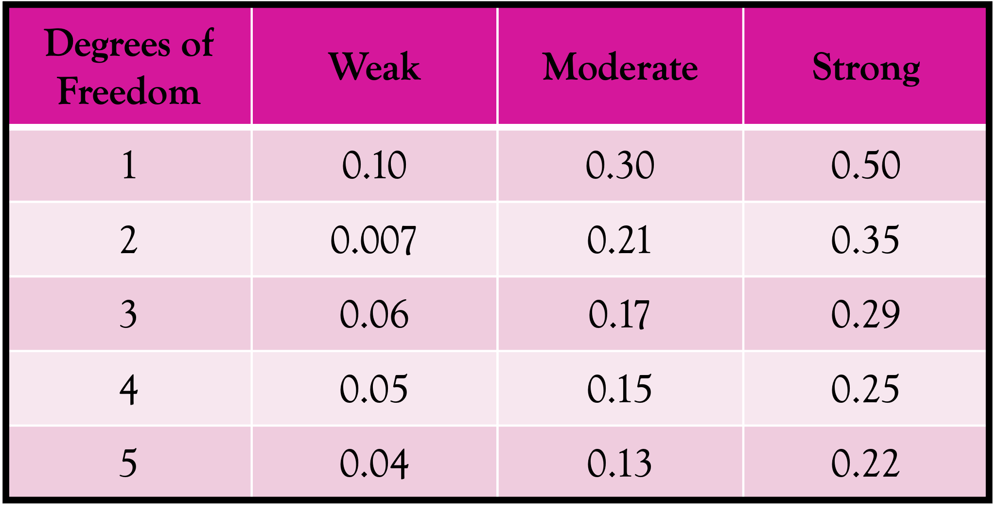
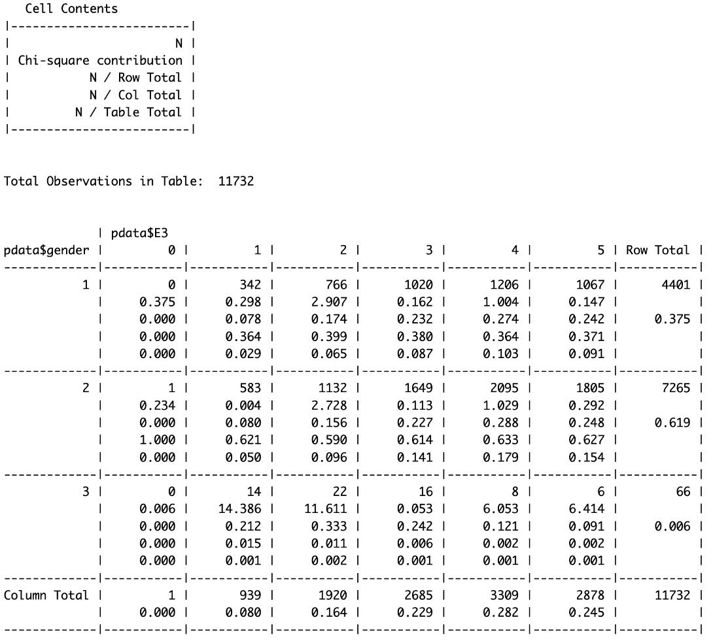
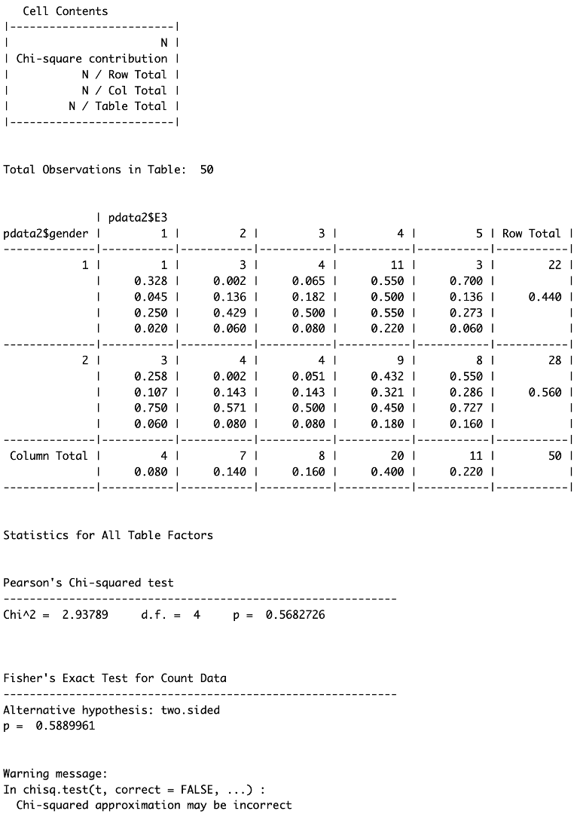

## To Begin...

```{r}
#| message: false
#| echo: true

library(rcompanion)
library(gmodels)
library(janitor)
library(rstatix)
library(tidyverse)
library(magrittr)
```

## What is Categorical Data?

**Any variable that falls into a discrete category.**

* Qualitative

* *Generally* mutually exclusive.

* Three types:
  * Binary
  * Nominal
  * Ordinal
  
##

* E1: I am the life of the party

* E2: I don’t talk a lot

* E3: I feel comfortable around people

  
```{r}
#| echo: true

pdata <- read.delim('/Users/christopherwolfe/Library/CloudStorage/GoogleDrive-chriswolfe93091@gmail.com/My Drive/ECU_Courses/Spring2025/ANTH_Stat/data/Personality_data.csv')

pdata %<>% select(gender, country, E1:E3)
pdata %<>% filter(gender != 0)
pdata %<>% mutate(across(.cols = everything(), .fns = as.factor))
pdata %<>% filter(country %in% c("US","GB","IN"))
head(pdata, 3)
```

## How to Analyze Categorical Data

::::{.columns}

:::{.column width = "33%"}

**Visualize**

* Contingency Table

* Bar plot

* Balloon plot


:::

:::{.column width = "33%"}

**Interpret**

* Cramér’s V

* Cross Tabulation

* Chi-Square

* Fisher’s Exact Test

:::

:::{.column width = "33%"}

**Visualize and Interpret**

* Multiple Correspondence Analysis (MCA)

:::

::::

## Contingency Tables 

**Summarizes relationships between categorical variable.**

*AKA cross-tabulations*

Evaluate the relationship between gender and being the life of the party:

```{r}
#| echo: true

# Male = 1, Female = 2, 3 = Other
# 1-5 = life of party

g_e1 <- table(pdata$gender, pdata$E1)
g_e1
```

##

**Proportions**

```{r}
#| echo: true

round(prop.table(g_e1), 3)
```

**Percentages**

```{r}
#| echo: true

round(prop.table(g_e1), 3)*100
```

## Bar Plots

```{r}
#| echo: true

pdata %>% select(gender, country, E1) %>% ggplot() + geom_bar(aes(x=E1, fill=gender), position="dodge") + theme_bw() + labs(x="E1: Life of the Party", y="Count", fill="Gender")

```

## Bar Plots

```{r}
#| echo: true

pdata %>% select(gender, country, E1) %>% ggplot() + geom_bar(aes(x=E1, fill=gender), position="dodge") + theme_bw() + labs(x="E1: Life of the Party", y="Count", fill="Gender") + facet_grid(country~.) + theme(legend.position = "top")

```

## Balloon Plots

```{r}
#| echo: true

library(ggpubr)
df <- pdata %>% group_by(gender, country) %>% summarize(Size=n()) %>% as.data.frame()

ggballoonplot(df, x=df$country, y=df$gender, value=df$Size)

```

## Cramer's V

**Association between 2 nominal variables.**

```{r}
#| echo: true

g_e1 <- table(pdata$gender, pdata$E1)

# library(rcompanion)
cramerV(g_e1)
```

```{r}
#| echo: true

# Degrees of Freedom
min(nrow(g_e1) - 1, ncol(g_e1) - 1)
```




## Cross Tabulation

```{r}
#| echo: true
#| eval: false

# library(gmodels)
CrossTable(pdata$gender, pdata$E3)

```

* Comparison of response to the question: “I feel comfortable around people” by self-identified gender:

    * Gender==1 (Male): Most males feel comfortable around people (74.8%, rating 3-5)

    * Gender==2 (Female): Most females feel comfortable around people (76.4%, rating 3-5)

    * Score==1 (Disagree): Less than 10% of respondents disagreed with the statement

##



## Chi-Squared Test

**Chi-squared test for independence**

* Used to determine if there is a significant relationship between two nominal/categorical variables (typically observed vs. expected outcomes)

* Null Hypothesis: the proportion of V1 is independent of V2 Ex: Gender is not related to whether someone feels comfortable around people

```{r}
#| echo: true

chisq.test(pdata$gender, pdata$E3)
```

## Chi-Squared Test

**Chi-squared test for independence**

```{r}
#| echo: true
#| warning: true

chisq.test(pdata$gender, pdata$E3)
```

**What does this mean?**

> Sample size issues! (Among others.)

## Fisher's Exact Test

**Non-Parametric Version of Chi-Squared**

```{r}
#| echo: true

set.seed(2024)  # allow for re-creation of random process
pdata2 <- pdata[sample(nrow(pdata), 50), ] %>% droplevels()
janitor::fisher.test(pdata2$gender, pdata2$E3)

```

> Use when count(s) are less than 5 fro >20% of the cells / categories

## Fisher's Exact Test

**Non-Parametric Version of Chi-Squared**

*Pairwise relationships - similar to ANOVA / Kruskal Wallis*

```{r}
#| echo: true

tab <- table(pdata2$gender, pdata2$E3)
rstatix::pairwise_fisher_test(tab)

```

## All Tests Together

```{r}
#| echo: true
#| eval: false

gmodels::CrossTable(pdata2$gender,pdata2$E3, fisher=TRUE, chisq=TRUE)

```



## Multiple Correspondence Analysis (MCA)

* Summarizes and Visualizes data tables with 2+ categorical variables

* Generalization of PCA when the variables to be analyzed are categorical instead of quantitative

* Goal of MCA: **What data cluster together?**

    * Demonstrates associations between variable categories
    
```{r}
#| echo: true

library(factoextra)
library(FactoMineR)
```

##


* MCA(X, ncp=5, graph=T):
    * X: data frame
    * ncp: number of dimensions kept in output
    * graph: whether a graph should be displayed

##
    
```{r}
#| echo: true
#| fig-show: hide

res_mca <- MCA(pdata)
```

```{r}
#| echo: true

fviz_mca_biplot(res_mca)
```

## 

```{r}
#| echo: true
#| fig-show: hide

# remove the outlier
pdata2 <- pdata[-11280, ]
 
# get back on track…
res_mca <- MCA(pdata2)

```

```{r}
#| echo: true

# check biplot again
fviz_mca_biplot(res_mca)

```

## 

The goal of an MCA is to quantify the **variation** in the data by reducing the dimensions to make it more interpretable.

* There are as many dimensions as variables. Generally, the first 2 (or few) explain the most variation.

```{r}
#| echo: true


fviz_screeplot(res_mca, 
	addlabels=T)
```

##

```{r}
#| echo: true

eig <- get_eigenvalue(res_mca)
head(eig)

```

## MCA

* coord: variable coordinates 

* contrib: variable contributions

* cos2: quality of variables

* v.test: degree of association between variable and PC

* eta2: proportion of variance in PC explained by independent variable using results of an ANOVA

```{r}
#| echo: true
var <- get_mca_var(res_mca)
names(var)

```

## Visualizing Variable Relationships

```{r}
#| echo: true

fviz_mca_var(res_mca, repel=T, 	ggtheme=theme_bw())
```

## Interpretation

* Inverse relationship between people who feel like the life of the party (E1) and are comfortable around people (E3) vs. people who do not talk a lot (E2)


```{r}
#| echo: true

fviz_mca_var(res_mca, repel=T, 	ggtheme=theme_bw())
```

## Interpretation

* Moderate responses group together


```{r}
#| echo: true

fviz_mca_var(res_mca, repel=T, 	ggtheme=theme_bw())
```

## Interpretation

* More extreme responses are more likely to be reported by individuals from India (IN) compared to the US and Great Britain (GB)


```{r}
#| echo: true

fviz_mca_var(res_mca, repel=T, 	ggtheme=theme_bw())
```

## Interpretation

* Low amount of variation in responses based on gender

```{r}
#| echo: true

fviz_mca_var(res_mca, repel=T, 	ggtheme=theme_bw())
```

## Interpretation

* Low amount of variation in responses based on gender

* Greater distance in general feelings about personality for gender=3 (“Other”), although could be due to small sample size (0.05% of all participants)


```{r}
#| echo: true

fviz_mca_var(res_mca, repel=T, 	ggtheme=theme_bw())
```

##


```{r}
#| echo: true
#| fig-show: hide

# remove the outlier
pdata3 <- pdata2 %>% filter(country == "IN")
 
# get back on track…
res_mca2 <- MCA(pdata3)
```

```{r}
#| echo: true

fviz_mca_ind(res_mca2, ggtheme=theme_bw(), habillage = pdata3$gender, addEllipses = T)
```

