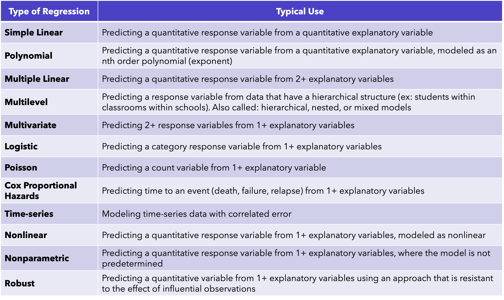
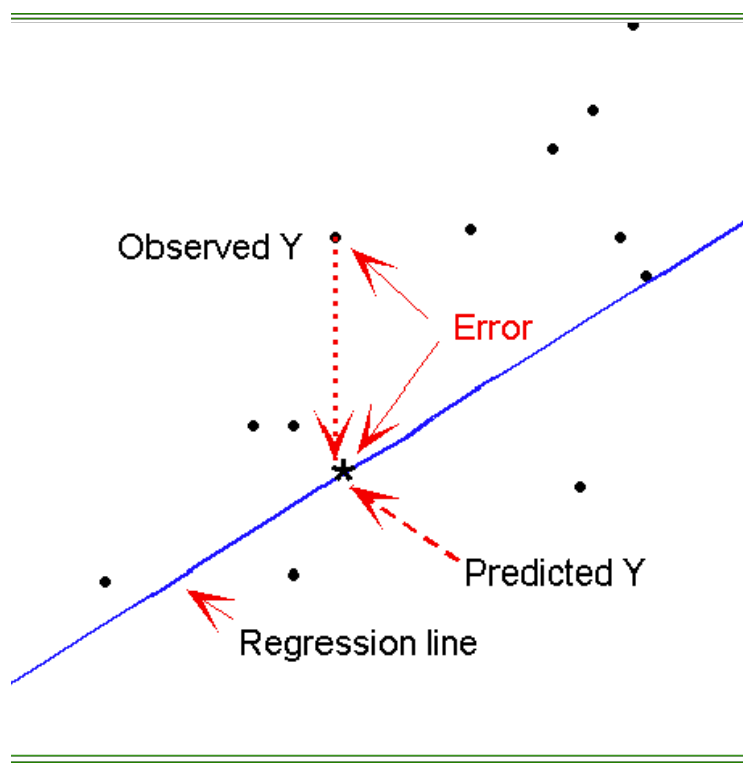
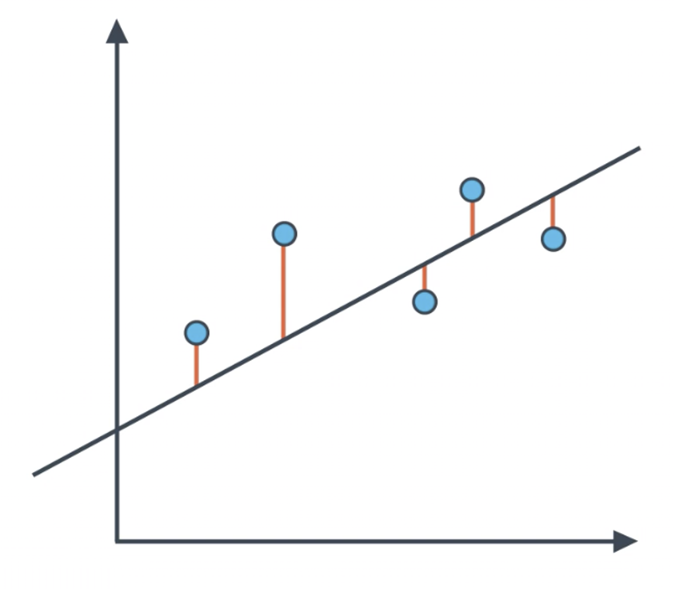
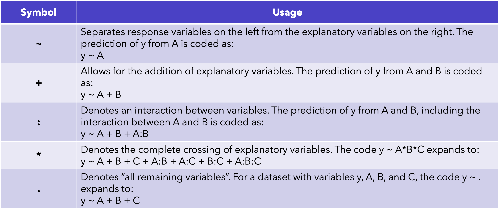
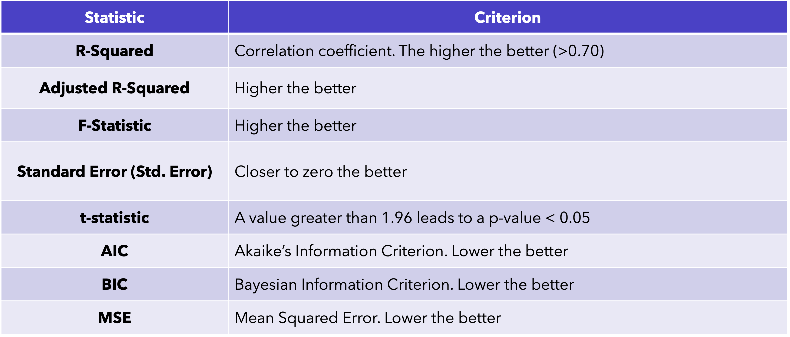

##

$$
y = \mathbf{m}x + \mathbf{b},
$$

* <span style="color:blue;">$m$</span> is a slope.

* <span style="color:red;">$b$</span> is a intercept.

***But, we can be more general...***

$$
y = X^T\beta
$$

* Here, $\mathbf{\beta}$ are parameters.

$$
y = \color{red}{\beta_0} + \color{blue}{\beta_1} + \color{blue}{\beta_2} + \color{blue}{\beta_k}
$$

## What is regression?

* Broad term for a set of methodologies used to **[predict]{.underline}** a response variable ($y$) from one or more predictor variables ($x$).

* $y$ can be quantitative or qualitative

* "Linear" regression is only 1 type. 

* We "regress the **response** variable on the **predictor** variable.

* SO MANY approaches stem from the mechanics underlying regression.

## Regression is used to...

* **[Identify]{.underline}** the input variables that are related to the output variable.

* **[Describe]{.underline}** the form of teh relationships under question.

* **[Provide]{.underline}** an equation for predicting the outcome variable from the input variables.

  * **The equation of a [line]{.underline}**

##



## Simple Linear Regression

**Simple:** only ***2*** variables being measured, $x$ and $y$.

**Linear:** the model is assessing the strength of a linear relationship between $x$ and $y$.

\

::: {style="text-align: center;"}
**Ordinary Least Squares**
:::

## Ordinary Least Squares{.smaller}

::::{.columns}

:::{.column width = "50%"}

**Q: Which line best fits the data?**

* The goal is for the *predicted* values to be as close to the *observed* values as possible.

  * The difference between the predicted and observed is known as a *residual* or *residual error*.
  
* The OLS [algorithm]{.underline} minimizes the *sum of the squared differences* between residuals.

:::

:::{.column width = "50%"}



:::

::::

##

* Each orange line represents an error, and the fit makes a compromise by averaging their distance to the line, squared


{fig-align="center"}

## Assumptions of Linear Regression

* **Normality:** for fixed values of the predictor, the response variable is normally distributed

* **Independence:** the response variable are independent of each other.

* **Linearity:** the response variable is linearly related to the predicted variable(s)

* **Homoskedasticity:** the variance of the response variable does not vary by predictor

## Linear Regression in R

```{r}
#| echo: true
#| eval: false

# Option 1:
fit <- lm(y~x, data=data) 
```

\

```{r}
#| echo: true
#| eval: false

# Option 2:
fit <- lm(data$y ~ data$x) 
```

`lm()` is the basic function for linear models, where:
  
  - `y`: response variable
  - `x`: predictor variable

::: {style="font-size: 0.75em;"}
The resulting object (`fit`) is a **list** that contains extensive information about the fitted model.

* R-squared, F-tests, Residual Standard Error, Coefficients, significance, etc.
:::

## Syntax to Know{.center}



## Regressing Femur on Humerus Length

```{r}
#| echo: true
#| message: false

library(tidyverse)
dat <- read.csv("goldman_pc.csv")
sub <- dat %>% select(lhml, LFML) %>% na.omit()
```

```{r}
#| echo: true

fit <- lm(LFML ~ lhml, sub)
summary(fit)
```

## Regressing Femur on Humerus Length{.smaller}

```{r}
#| echo: true

summary(fit)
```

* **Estimate:** Model coefficients
  * Coefficient = **effect**

* **Pr(>|t|):** significance of the coefficient being statistically different from zero

$$
\text{femur} = 50.0081 + 1.2414(\text{humerus}) 
$$

## 

```{r}
#| echo: true

summary(fit)
```

* **Residual Standard Error:** the average error in predicting y from x in the current model
  
  * In this case, the average error of predicting femur length from humerus length is 12.96 mm.

## {.smaller}

```{r}
#| echo: true

summary(fit)
```

* **Adjusted R-Squared:** the proportion of variability in y that can be explained by x

  * In this case, 83% of the variation in femur length can be explained by humerus length.
  
  * **NOTE:** $R^2$ will always increase with more predictors.
  *  The $\sqrt{}$ of the adjust $R^2$ is the Pearson correlation.
  
## {.smaller}

```{r}
#| echo: true

summary(fit)
```

* **F-statistic:** whether the predictor variables, taken together, can predict the response variable above random chance.

  * Relates to p-value
  
* **p-value:** the probability that the value of the F-statistic would happen if the null hypothesis were true

::: {style="text-align: center;"}
**Null Hypothesis: all coefficients in the model are equal to zero**
:::

##



## Confidence and Prediction Intervals{.smaller}

* **Confidence Intervals (CI):** how well you have determined them mean

    * Informs about the likely location of the true population parameter
    
    * Given the value of x, the associated mean value of y is within the lower and upper limits with (1-α) confidence
    
* **Prediction Intervals:** where you can expect to see the next data point sampled

  * Informs about the distribution of [values]{.underline}
  
  * Given the value of x, the associated predicted value of y is within the lower and upper limits with ($1-α$) confidence
  
::: {style="text-align: center;"}
**The PI is always wider than the CI**
:::
  
## 

The `predict()` function is ubiquitous across R. It recognizes **MANY** predictive algorithms. It returns predictions based on the fitted data OR new data.

```{r}
head(predict(fit, interval="confidence"))
```

##

* You could use `predict` for a single observations...

```{r}
#| echo: true

new_obs <- data.frame(lhml = 300)

predict(fit, newdata=new_obs, interval="prediction")

```

* Or multiple observations...

```{r}
#| echo: true

new_obs <- data.frame(lhml = c(300, 200, 100, 150, 350))

predict(fit, newdata=new_obs, interval="prediction")

```

## Putting it All Together

* Add the predictions back in...

```{r}
#| echo: true

ci <- predict(fit, interval="confidence") %>% as.data.frame()
pi <- as.data.frame(predict(fit, interval="prediction"))

names(ci) <- c("fit","lwrCI","uprCI")
names(pi) <- c("fit","lwrPI","uprPI")


```

##

```{r}
#| echo: true

sub2 <- cbind(sub, ci, pi[c("lwrPI","uprPI")])
head(sub2)

```

##

```{r}
#| echo: true

ggplot(sub2) + theme_bw() + geom_point(aes(x=lhml, y=LFML)) + geom_line(aes(x=lhml, y=lwrPI), lty="dashed") + geom_line(aes(x=lhml, y=uprPI), lty="dashed") + geom_smooth(aes(x=lhml, y=LFML), method = "lm", col = "tomato")

```

## Multiple Regression

* 2+ predictors, 1 outcome

```{r}
#| echo: true

states <- as.data.frame(state.x77)

mod1 <- lm(Murder ~ Population, data=states)
mod2 <- lm(Murder ~ Population + Illiteracy, data=states)
mod3 <- lm(Murder ~ Population + Illiteracy + Frost, data=states)

```

## Multiple Regression: Model Comparison

**This is only one way to compare!**

* `anova`: compares the model evaluation metrics to determine whether the addition of variables improves the fit of the overall model

```{r}
#| echo: true

anova(mod1, mod2, mod3)

```

## Multiple Regression: Model Comparison {.smaller}

**Here is another...**

`AIC()`: "Akaike’s Information Criterion", accounts for model fit but also the number of parameters needed to achieve it AKA [parsimony]{.underline}

  * The smaller the AIC, the better the model
  
  * Does not require nested models, but cannot compare between models with different transformations (ex: linear vs. logarithmic)
  
```{r}
#| echo: true

AIC(mod1, mod2, mod3)
```

## The Best Model

```{r}
#| echo: true

summary(mod2)
```

## Multiple Regression: Adding Interactions

* Key: It is good practice to always center the independent variables when including an interaction between model terms. It is actual good practice to do this with any *continuous* predictor.

```{r}
#| echo: true

states$Population_c <- states$Population - mean(states$Population)

states$Illiteracy_c <- states$Illiteracy - mean(states$Illiteracy)

head(states[c("Population","Population_c","Illiteracy","Illiteracy_c")])

```

## 

```{r}
#| echo: true

mod2_int <- lm(Murder ~ Population_c * Illiteracy_c, data=states)

round(summary(mod2_int)$coefficients, 3)

```

**Interpretation:**
There is not a significant interaction between Population and Illiteracy that affects the overall prevalence of Murder

##
