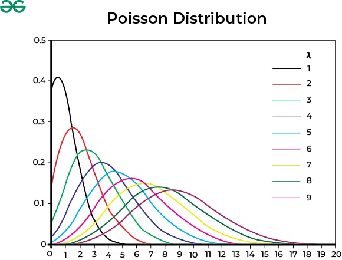
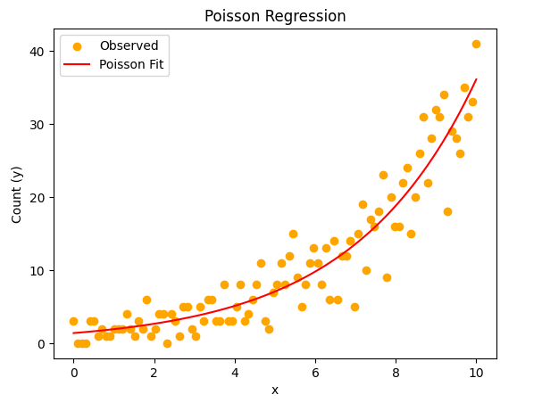
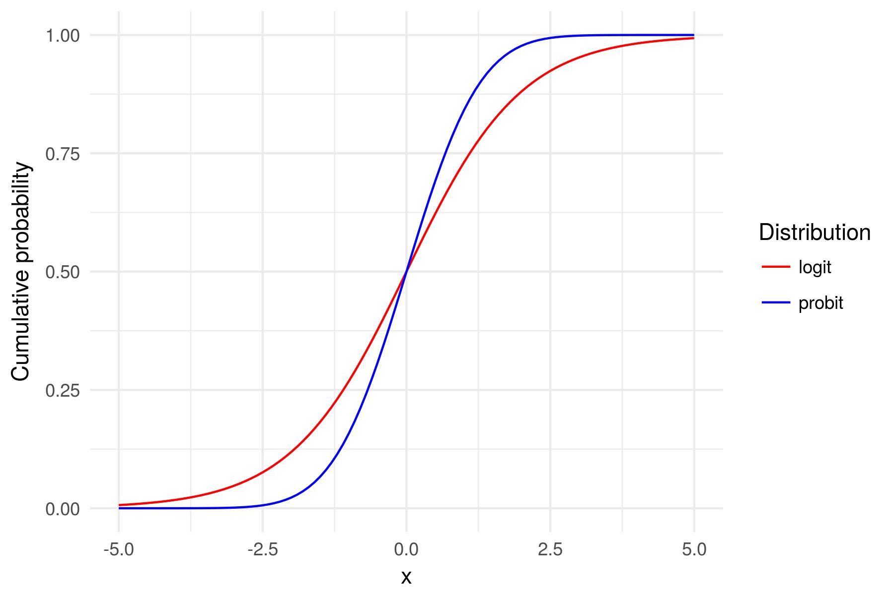

## Linear Model Assumptions

* Normally distributed [errors]{.underline}

* Additive effects (remember the `+` sign)

* Generally continuous outcome

* Linear predictor $X\beta$

  * `X` = predictors; $\beta$ = coefficients
  
#

How can we predict an outcome that is not continuous?

**Caveat: We still think of this as a 'linear' model**

$$
g(y) = \beta_0 + \beta_1X_1 + \beta_2X_2 + \beta_kX_k
$$

***This setup means the `y` variable is still a [linear] combination of variables.***

## Generalized Linear Models

* Outcome data `y` that are non-continuous

  * Binary (0/1)
  * Multiple Categories
  * Ordinal Data
  * Count Data
  
* We use something called a **link function** to [*transform*]{.underline} the observed data to something that looks [***linear***].

$$
g(y) = \beta_0 + \beta_1X_1 + \beta_2X_2 + \beta_kX_k
$$

## Logistic Regression

* Categorical Outcomes [one way...]

    * Binary (Bernoulli)
    * Multinomial
    
* Logistic distribution

    * We are going to focus on the "simple" binary case. But the logit link function can be used across different types of non-continuous data.

$$
\text{logit}(p) = \ln\left( \frac{p}{1-p} \right) = \beta_0 + \beta_1 x_1 + \dots + \beta_k x_k
$$

##


## Algorithm

**Maximum Likelihood Estimation**

* Parameters are chosen to *maximize* the likelihood that the assumed model fits the data

    * Find parameters of a model that *maximize* the likelihood of the output. 
    
    * The **higher** the likelihood the better the fit.
    
* Note - this algorithm can work instead of **OLS**! I would recommend MLE or [Bayesian]{.underline} approaches.

## Assumptions of a Binary Logistic Regression

1.  The dependent variable must be a mutually exclusive dichotomy

2.  There are no extraneous variables

3.  Input variables are not collinear

4.  Observations are independent

5.  Observations are independent

6.  $>50$ cases per predictor class

## Practical Example

**Data:** Acceptance information for 400 individuals with GRE, GPA, and undergraduate class ranking


**Research Question:** Am I going to be accepted to UCLA for graduate school?


**Code:**

`glm(y ~ x, data=data, family="binomial")`


`y ~ x`: formula for the relationship under investigation


`family="binomial"`: necessary to define you want logistic regression

## Logistic Regression in R

```{r}
#| echo: true


grad <- read.csv("https://stats.idre.ucla.edu/stat/data/binary.csv")
grad$admit <- factor(grad$admit)
grad$rank <- factor(grad$rank)
summary(grad)
```

## Logistic Regression in R

**Your outcome variable must be coded as 0/1 and recognized as a numeric!**

```{r}
#| echo: true

fit <- glm(admit ~ gre + gpa + rank, data=grad,        family="binomial")
summary(fit)

```

## Logistic Regression in R {.smaller}

::::{.columns}

:::{.column width = "50%"}

```{r}
#| echo: false

summary(fit)

```

:::

:::{.column width = "50%"}

**Coefficients:** each variable’s impact on and individual’s chance of admittance

* In this case, each variable has a significant impact on the “admit” variable


**Deviance:**

* Null = null hypothesis that there is no difference in admittance rate based on gre, gpa, or ranking

* Residual = how much the model changes by including variables

      * Residual < Null means that the inclusion of gre, gpa, and ranking improved the model fit

* AIC: Akaike’s Information Criterion, more useful when comparing between models for model selection

:::
::::

## Interpretation{.smaller}

::::{.columns}

:::{.column width = "50%"}

```{r}
#| echo: false

summary(fit)

```

:::

:::{.column width = "50%"}

* All coefficients are on the **log scale**!

  * Initial interpretation is as a log odd.
  
* For a one-unit increase in gre, the log odds of admission increases by 0.002

* For a one-unit increase in gpa, the log odds of admission increases by 0.804

* Having a rank of 2 changes the odds of admission by -0.675 as compared to Rank 1.

* Having a rank of 3 changes the odds of admission by -1.340 as compared to Rank 1.

* Having a rank of 4 changes the odds of admission by -1.551 as compared to Rank 1.


:::
::::

#

**What the heck is a log odd!**

## Interpretation

* When we use GLMs, interpretation becomes tricky because of the [link]{.underline} function. 

$$
\text{logit}(p) = \ln\left( \frac{p}{1-p} \right) = \beta_0 + \beta_1 x_1 + \dots + \beta_k x_k
$$

* Notice all the natural logs (ln).

    * To get back to an interpretable scale we must take the inverse of the logarithm.
    
    * Exponentiate! $e^x$
    
##  Generating Odds Ratios

Exponentiate coefficients to get the **Odds Ratio:**

* **Odds Ratio:** how much the odds (not log odds) of the outcome increase with a one-unit change in the independent variable. ***This is the most important part when interpreting a logistic regression model.***

  * After exponentiating, coefficients > 1 indicate a positive relationship (an increase in odds) and those < 1 are a negative relationship (a decrease in odds)
  
```{r}
#| echo: true

exp(fit$coefficients)

```

## Odds 


## Odds to Probability


## Beyond Odds Ratios

* Logistic regression is commonly used in binary classification problems

  * Think Biological Sex in forensic anthropology...
  
* Part of the model fit stores predictions from the model.

  *  Note, if you were to test this, you should do it on unseen data...
  
```{r}
#| echo: true

head(fit$fitted.values, 14)

```

##

* If the fitted value is < 0.5, admit == 0. If ≥ 0.5, admit == 1


##

```{r}
#| echo: true

grad$admit_pred <- ifelse(fit$fitted.values >= 0.5, 1, 0)
ct <- table(grad$admit_pred, grad$admit)
ct
```

## Classification Statistics

```{r}
#| echo: true

# install.packages("caret")

caret::confusionMatrix(factor(grad$admit_pred),   factor(grad$admit))
```

## Classification Statistics

* **No Information Rate:** largest proportion of the observed classes (outcome)

  * There were more rejections (0) than acceptances (1) in the admit column

* **P-Value [Acc > NIR]:** whether the overall accuracy is greater than the rate of occurrence by the largest class

**Kappa:** unweighted Kappa statistic

**Mcnemar’s Test P-Value:** are there differences in the predicted vs known values of admit

## 


## Extra!

In all classification problems, **unbalanced classes** may be an issue. 

* A class may be unbalanced if there are **many** more observed individuals in one category as compared to another. 

  * May bias the final accuracy of the model. 
  
```{r}
#| echo: true
#| message: false

library(tidyverse)
grad %>% group_by(admit) %>% summarise(count=n())

```

## Extra

* One solution:

**Downsampling**

```{r}
#| echo: true


newsamp <- caret::downSample(grad[2:4], factor(grad$admit))
newsamp %>% group_by(Class) %>% summarize(count=n())

fit2 <- glm(Class ~ gre + gpa + rank, data=newsamp,        family="binomial")
```

## 

:::{.panel-tabset}

## Fit 1

```{r}
#| echo: true

fit
```

## Fit 2

```{r}
#| echo: true

fit2
```

:::

## Practice

* Import howells.csv

* Create a subset of ID, Sex, Pop, GOL, NOL, XCB, XFB, ZYB, AUB, WCB, and ASB

* Run logistic regression using Sex as the response variable

* Which variables were significant to the model?
 
* What is the rate of misclassification?

* Create Odds Ratios and interpret them

# Count Data

* Poisson

* Negative Binomial

## Poisson Regression

$$
y_i \sim Poisson(e^{X_i\beta})
$$

* $y$ follows a Poisson distribution

* Logarithmic link function

  * Remember the opposite here is to exponentiate!
  
* Mean = variance

* **Interpretation:** The count of the $y$ variable changes as a factor / magnitude of the predictor.

##

::::{.columns}

:::{.column width = "50%"}



:::

:::{.column width = "50%"}



:::

::::

##

## 

```{r}
#| echo: true

set.seed(1991)

n <- 50
x <- runif(n, -2, 2)
a <- 1
b <- 2
linpred <- a + b*x
y <- rpois(n, exp(linpred))
fake <- data.frame(x = x, y = y)
head(fake)
```

##

```{r}
#| echo: true
#| message: false

library(tidyverse)

library(ggplot2)

ggplot(fake, aes(x = x, y = y)) +
  geom_point() +
  geom_smooth(method = "glm", 
              method.args = list(family = "poisson"), 
              se = TRUE) + theme_classic()
```

## Poisson Regression

```{r}
#| echo: true

pois <- glm(y ~ x, family = "poisson", data = fake)
summary(pois)
```

## Interpretation

* Model Scale
  
  * Log-count per unit increase...
  
* Real World Scale

  * $e^x$ 
  
    * Rate / Count per unit increase
    
```{r}
#| echo: true

exp(pois$coefficients)
```

## Incidence Rate Ratio

* IRR > 1 = A one unit increase in predictor increases the expected count.

* IRR < 1: A one-unit increase in the predictor decreases the expected count.

* Our Model:

  * IRR = 7.45
  
    * For every 1 unit change in X, the count increases by 7.45 times or a 645% increase.
    
## Over and Under Dispersion

**Remember, an assumption of Poisson is that the variance equals the mean and DOES NOT change**

What happens if there is more or less variation? 

##

```{r}
phi_grid <- c(0.1, 1, 10)
K <- length(phi_grid)
y_nb <- as.list(rep(NA,K))
fake_nb <- as.list(rep(NA, K))
fit_nb <- as.list(rep(NA, K))

library(MASS)
for(k in 1:K){
  
  y_nb[[k]] <- rnegbin(n, exp(linpred), phi_grid[k])
  fake_nb[[k]] <- data.frame(x=x, y=y_nb[[k]])
  fit_nb[[k]] <- glm.nb(y ~ x, data = fake_nb[[k]])
  
}

```

:::{.panel-tabset}

## Dispersion 1

```{r}
x <- fake_nb[[1]]$x
plot(fake_nb[[1]]$x, fake_nb[[1]]$y)
curve(exp(coef(fit_nb[[1]])[1] + coef(fit_nb[[1]])[2]*x), add = T )
```

## Dispersion 2

```{r}
x <- fake_nb[[2]]$x
plot(fake_nb[[2]]$x, fake_nb[[2]]$y)
curve(exp(coef(fit_nb[[2]])[1] + coef(fit_nb[[2]])[2]*x), add = T )
```

## Dispersion 3

```{r}
x <- fake_nb[[3]]$x
plot(fake_nb[[3]]$x, fake_nb[[3]]$y)
curve(exp(coef(fit_nb[[3]])[1] + coef(fit_nb[[3]])[2]*x), add = T )
```

:::

## Negative Binomial Regression

* Generalization of Poisson with over / under dispersion

  * Having lots of 0's counts as a dispersion issue.
  
* Generally more robust in real world scenarios...

$$
y_i \sim negative\space binomial(e^{X_i\beta}, \phi) 
$$

## Roaches Example

```{r}
#| echo: true

roach <- rosdata::roaches
roach$roach100 <- roach$roach1 / 100
head(roach)
```

```{r}
#| echo: true

fit1 <- glm(y ~ roach100 + treatment + senior, family = "poisson", data = roach)

library(MASS)
fit2 <- glm.nb(y ~ roach100 + treatment + senior, data = roach)
```

## 

:::{.panel-tabset}

## Poisson

```{r}
summary(fit1)
```

## Negative Binomial

```{r}
summary(fit2)
```

:::

```{r}
#| echo: true

exp(fit2$coef)
```


## Logistic Binomial

* Previously, we fit a logistic regression to binary data...

  * What if we have count data and want to know a probability of success.
  
  
```{r}
#| echo: true

N <- 100
height <- rnorm(N, 72, 3)
p <- 0.4 + 0.1*(height-72) / 3
n <- rep(20, N)
y <- rbinom(N, n, p)
data <- data.frame(n = n, y = y, height = height)
```

$$
y_i \sim Binomial(n_i, p_i) 
\newline
p_i = logit^-1(X_i\beta)
$$

## Logistic Binomial Regression 

```{r}
#| echo: true

binom <- glm(cbind(y, n-y) ~ height, family = "binomial", data = data)

summary(binom)
```

```{r}
#| echo: true

exp(binom$coef)
```

## Probit Regression

**Normally Distributed Latent Data**

* Similar construction to the logit model, except the link function changes to the probit link function.

* Logit = Logistic distribution

  * Ambiguous interpretation
  
  * Mathematically easier

* Probit = Normal Distribution

  * Straightforward interpretation
  
  * Mathematically more difficult
  
##



## Comparison

`Wells` dataset

$$
y_i = \begin{cases} 1 & \text{if } \text{household switched to a new well} \\ 0 & \text{otherwise } \text{household did not switcn wells} \end{cases}
$$

```{r}
#| echo: true

wells <- rosdata::wells
head(wells)
```

## Comparison

:::{.panel-tabset}

## Logit

```{r}
#| echo: true

logit_model <- glm(switch ~ dist100, data = wells, family = binomial(link = "logit"))

summary(logit_model)

```

## Probit

```{r}
#| echo: true

# Probit Regression
probit_model <- glm(switch ~ dist100, data = wells, family = binomial(link = "probit"))

summary(probit_model)

```

:::

## Interpretation

* Logit

  * Odds / Log Odds
  
```{r}
#| echo: true

exp(logit_model$coef)
```

* Probit

  * Z-Score (untransformed) / Probability (transformed)
  
    * Inverse of the probit = CDF = `pnorm`
 
```{r}
#| echo: true

pnorm(probit_model$coef)
```

## Odds vs Probability

**Intercept = Bad well directly adjacent to good well**

* Logistic Regression

  * The odds of switching wells are 1.83 likely if next to a safe well. 
  
  * The probability of switching wells is: $\frac{odds}{1+odds} = \frac{1.83}{1+1.83} = 0.64$
  
* Probit Regression

  * The probability of switching wells is 64%. 
  
***Identical results!***

##

