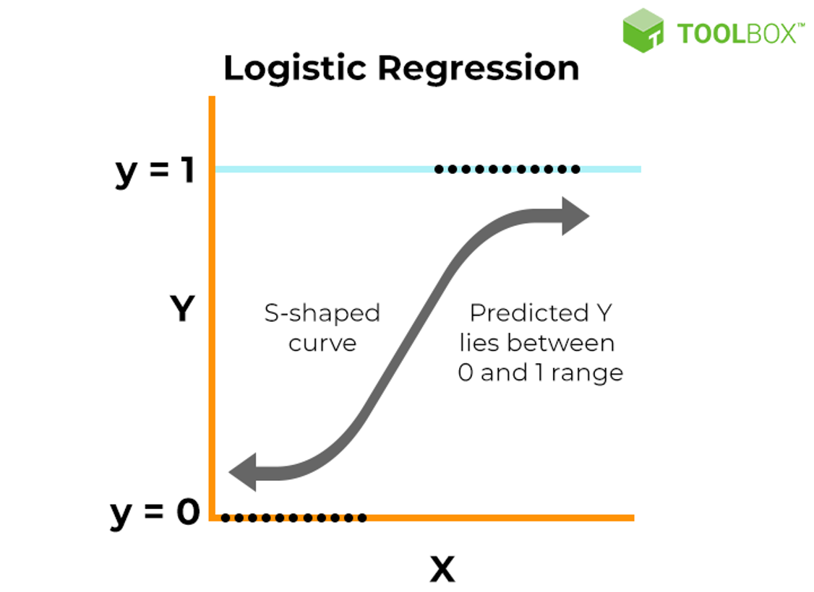
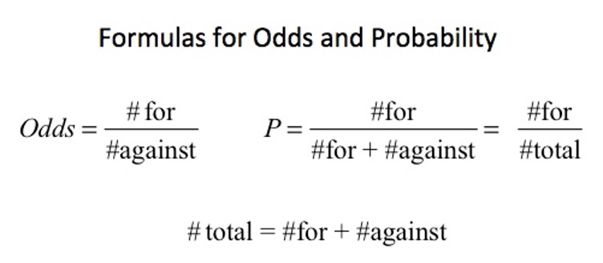
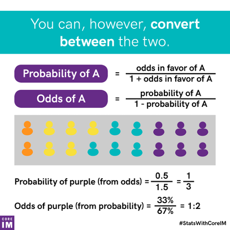
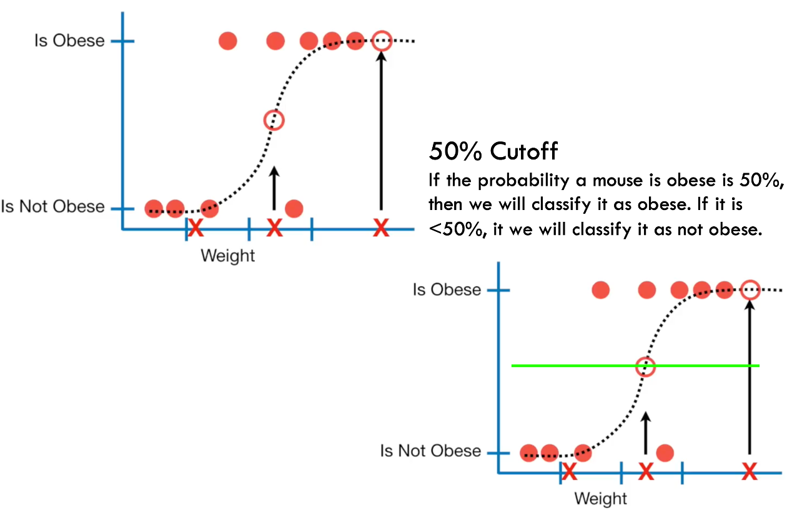
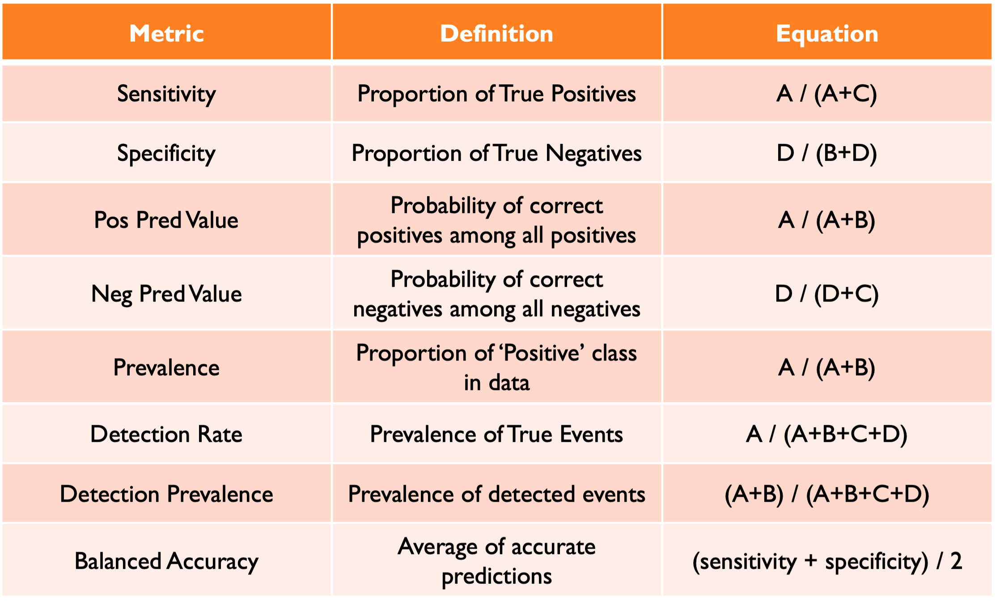

## Linear Model Assumptions

* Normally distributed [errors]{.underline}

* Additive effects (remember the `+` sign)

* Generally continuous outcome

* Linear predictor $X\beta$

  * `X` = predictors; $\beta$ = coefficients
  
#

How can we predict an outcome that is not continuous?

**Caveat: We still think of this as a 'linear' model**

$$
g(y) = \beta_0 + \beta_1X_1 + \beta_2X_2 + \beta_kX_k
$$

***This setup means the `y` variable is still a [linear] combination of variables.***

## Generalized Linear Models

* Outcome data `y` that are non-continuous

  * Binary (0/1)
  * Multiple Categories
  * Ordinal Data
  * Count Data
  
* We use something called a **link function** to [*transform*]{.underline} the observed data to something that looks [***linear***].

$$
g(y) = \beta_0 + \beta_1X_1 + \beta_2X_2 + \beta_kX_k
$$

## Logistic Regression

* Categorical Outcomes [one way...]

    * Binary (Bernoulli)
    * Multinomial
    
* Logistic distribution

    * We are going to focus on the "simple" binary case. But the logit link function can be used across different types of non-continuous data.

$$
\text{logit}(p) = \ln\left( \frac{p}{1-p} \right) = \beta_0 + \beta_1 x_1 + \dots + \beta_k x_k
$$

##



## Algorithm

**Maximum Likelihood Estimation**

* Parameters are chosen to *maximize* the likelihood that the assumed model fits the data

    * Find parameters of a model that *maximize* the likelihood of the output. 
    
    * The **higher** the likelihood the better the fit.
    
* Note - this algorithm can work instead of **OLS**! I would recommend MLE or [Bayesian]{.underline} approaches.

## Assumptions of a Binary Logistic Regression

1.  The dependent variable must be a mutually exclusive dichotomy

2.  There are no extraneous variables

3.  Input variables are not collinear

4.  Observations are independent

5.  Observations are independent

6.  $>50$ cases per predictor class

## Practical Example

**Data:** Acceptance information for 400 individuals with GRE, GPA, and undergraduate class ranking


**Research Question:** Am I going to be accepted to UCLA for graduate school?


**Code:**

`glm(y ~ x, data=data, family="binomial")`


`y ~ x`: formula for the relationship under investigation


`family="binomial"`: necessary to define you want logistic regression

## Logistic Regression in R

```{r}
#| echo: true


grad <- read.csv("https://stats.idre.ucla.edu/stat/data/binary.csv")
grad$admit <- factor(grad$admit)
grad$rank <- factor(grad$rank)
summary(grad)
```

## Logistic Regression in R

**Your outcome variable must be coded as 0/1 and recognized as a numeric!**

```{r}
#| echo: true

fit <- glm(admit ~ gre + gpa + rank, data=grad,        family="binomial")
summary(fit)

```

## Logistic Regression in R {.smaller}

::::{.columns}

:::{.column width = "50%"}

```{r}
#| echo: false

summary(fit)

```

:::

:::{.column width = "50%"}

**Coefficients:** each variable’s impact on and individual’s chance of admittance

* In this case, each variable has a significant impact on the “admit” variable


**Deviance:**

* Null = null hypothesis that there is no difference in admittance rate based on gre, gpa, or ranking

* Residual = how much the model changes by including variables

      * Residual < Null means that the inclusion of gre, gpa, and ranking improved the model fit

* AIC: Akaike’s Information Criterion, more useful when comparing between models for model selection

:::
::::

## Interpretation{.smaller}

::::{.columns}

:::{.column width = "50%"}

```{r}
#| echo: false

summary(fit)

```

:::

:::{.column width = "50%"}

* All coefficients are on the **log scale**!

  * Initial interpretation is as a log odd.
  
* For a one-unit increase in gre, the log odds of admission increases by 0.002

* For a one-unit increase in gpa, the log odds of admission increases by 0.804

* Having a rank of 2 changes the odds of admission by -0.675 as compared to Rank 1.

* Having a rank of 3 changes the odds of admission by -1.340 as compared to Rank 1.

* Having a rank of 4 changes the odds of admission by -1.551 as compared to Rank 1.


:::
::::

#

**What the heck is a log odd!**

## Interpretation

* When we use GLMs, interpretation becomes tricky because of the [link]{.underline} function. 

$$
\text{logit}(p) = \ln\left( \frac{p}{1-p} \right) = \beta_0 + \beta_1 x_1 + \dots + \beta_k x_k
$$

* Notice all the natural logs (ln).

    * To get back to an interpretable scale we must take the inverse of the logarithm.
    
    * Exponentiate! $e^x$
    
##  Generating Odds Ratios

Exponentiate coefficients to get the **Odds Ratio:**

* **Odds Ratio:** how much the odds (not log odds) of the outcome increase with a one-unit change in the independent variable. ***This is the most important part when interpreting a logistic regression model.***

  * After exponentiating, coefficients > 1 indicate a positive relationship (an increase in odds) and those < 1 are a negative relationship (a decrease in odds)
  
```{r}
#| echo: true

exp(fit$coefficients)

```

## Odds 



## Odds to Probability



## Beyond Odds Ratios

* Logistic regression is commonly used in binary classification problems

  * Think Biological Sex in forensic anthropology...
  
* Part of the model fit stores predictions from the model.

  *  Note, if you were to test this, you should do it on unseen data...
  
```{r}
#| echo: true

head(fit$fitted.values, 14)

```

##

* If the fitted value is < 0.5, admit == 0. If ≥ 0.5, admit == 1



##

```{r}
#| echo: true

grad$admit_pred <- ifelse(fit$fitted.values >= 0.5, 1, 0)
ct <- table(grad$admit_pred, grad$admit)
ct
```

## Classification Statistics

```{r}
#| echo: true

# install.packages("caret")

caret::confusionMatrix(factor(grad$admit_pred),   factor(grad$admit))
```

## Classification Statistics

* **No Information Rate:** largest proportion of the observed classes (outcome)

  * There were more rejections (0) than acceptances (1) in the admit column

* **P-Value [Acc > NIR]:** whether the overall accuracy is greater than the rate of occurrence by the largest class

**Kappa:** unweighted Kappa statistic

**Mcnemar’s Test P-Value:** are there differences in the predicted vs known values of admit

## 



## Extra!

In all classification problems, **unbalanced classes** may be an issue. 

* A class may be unbalanced if there are **many** more observed individuals in one category as compared to another. 

  * May bias the final accuracy of the model. 
  
```{r}
#| echo: true
#| message: false

library(tidyverse)
grad %>% group_by(admit) %>% summarise(count=n())

```

## Extra

* One solution:

**Downsampling**

```{r}
#| echo: true


newsamp <- caret::downSample(grad[2:4], factor(grad$admit))
newsamp %>% group_by(Class) %>% summarize(count=n())

fit2 <- glm(Class ~ gre + gpa + rank, data=newsamp,        family="binomial")
```

## 

:::{.panel-tabset}

## Fit 1

```{r}
#| echo: true

fit
```

## Fit 2

```{r}
#| echo: true

fit2
```

:::

## Practice

* Import howells.csv

* Create a subset of ID, Sex, Pop, GOL, NOL, XCB, XFB, ZYB, AUB, WCB, and ASB

* Run logistic regression using Sex as the response variable

* Which variables were significant to the model?
 
* What is the rate of misclassification?

* Create Odds Ratios and interpret them
