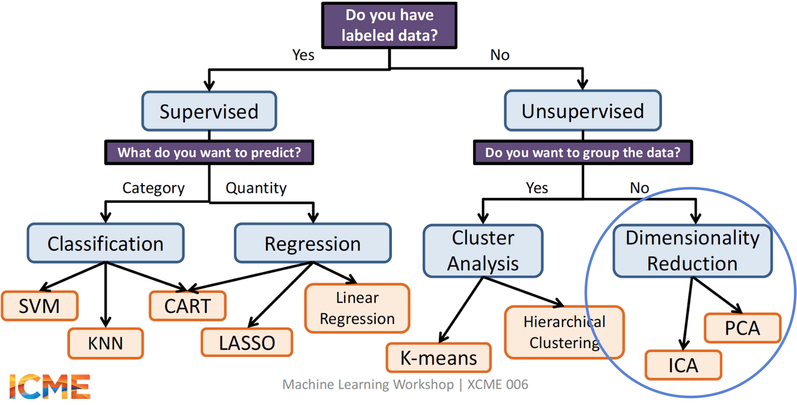
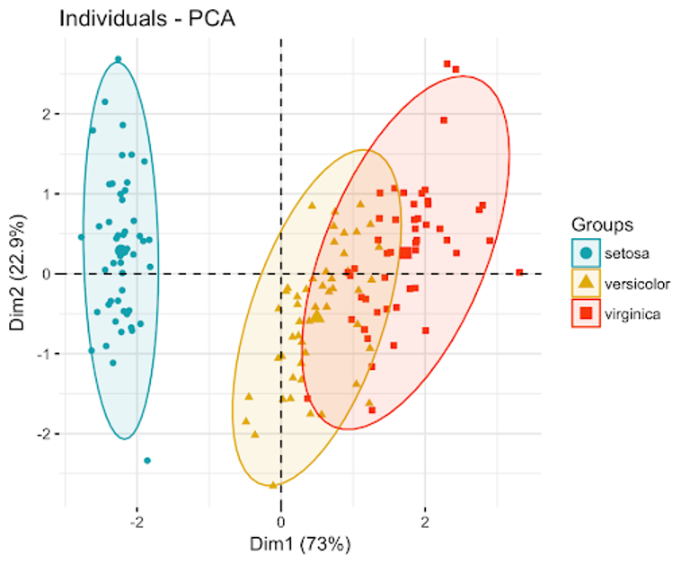
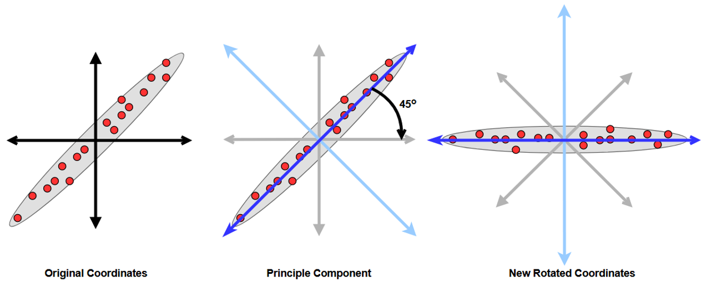
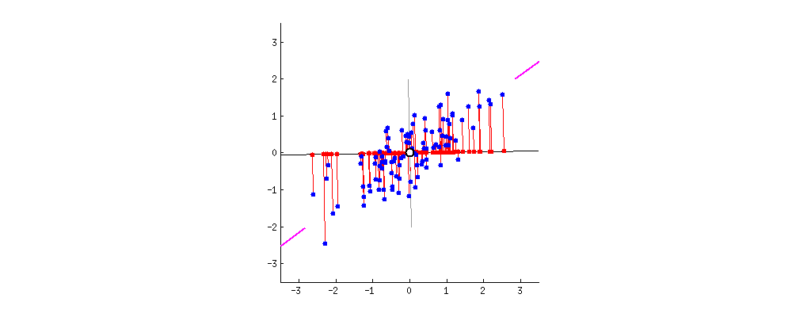
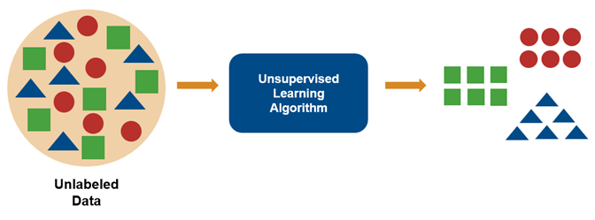
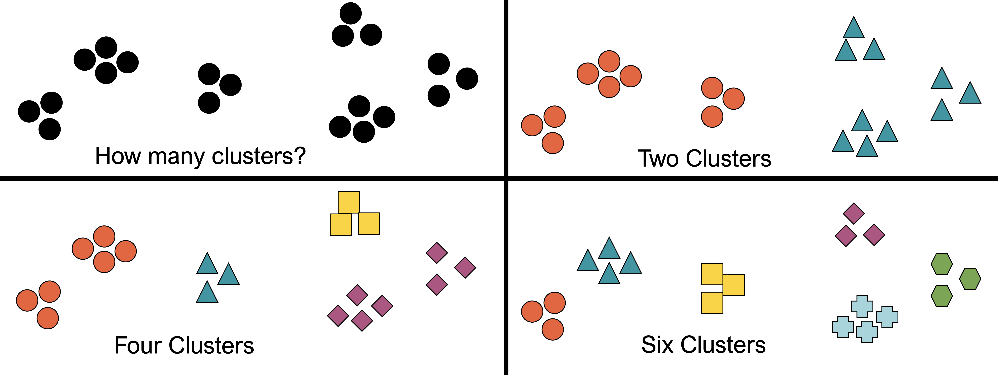
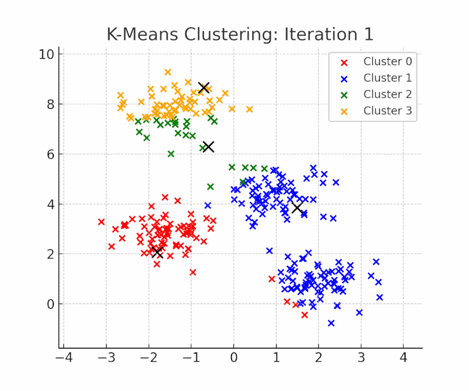
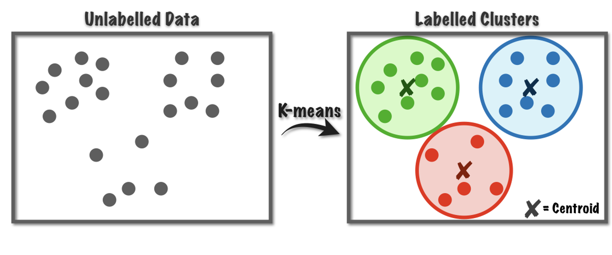

# Principal Components Analysis

## 

{fig-align="center"}

## Dimensionality Reduction{.smaller}

* Reduces the data into its [basic components]{.underline} 
  * ***removes*** unnecessary parts / information 
  * ***reduces*** the number of variables needed while retaining information

* Most traditional statistical techniques are intended for low-dimensional data
  * Low dimensional: more observations (rows) than features (columns)
  * High dimensional: more features (columns) than observations (rows)

\

**How do you make sense of all the inter-relationships between variables?**

## What is PCA? {.smaller}

> An [unsupervised]{.underline} algorithm that transforms many **correlated** variables into **uncorrelated** variables while retaining the same information.

* Correlated = Shared information [multicollinearity!]
  * If information is shared, why not eliminate redundancy?
  
* Linear combinations of original variables that captures the ***maximum variance***

* Result is new **composite** variables (“dimensions”) that are [orthogonal]{.underline} (perpendicular) to each other

* Each component captures the largest possible variance

##

{fig-align="center"}

## PCA Process

1.  Find the axis (line) that captures the most variance for PC1

2.  The axis perpendicular to that becomes PC2 and is uncorrelated with PC1

3.  Rotate the data so that PC1 is the new x-axis and PC2 is the new y-axis

4.  Repeat steps until either a) # PCs == # features or b) # PC == # rows, whichever comes first

* The new coordinates for each point in PC space are called the principal component scores

##



##



## What's in a Name?

Q: PCA finds the ***principal components*** of the data
  
  * What does that mean?

\

A: PCA finds the underlying structure in the data, focusing on capturing the ***[most variance]{.underline}***, which is the most important (“principal”) when quantifying how data are structured

## Words and Definitions

**Eigenvector:** direction of the line or axis (aka principal component)

**Eigenvalue:** the amount of variation retained by each principal component

**Loadings:** the weight/influence each original feature has on a specific eigenvector

> The eigenvector with the highest eigenvalue is always PC1.

## PCA Housekeeping

Things to know before using a PCA:

* Data must be **normalized/scaled** 
  * RECALL: `scale()` function
  
* PCA can only be conducted on continuous variables

* No missing data allowed!

* Highly affected by outliers

* Assumes a multivariate normal distribution of the data

* May be too rigid depending on data type AND relationship type(s)

## Practical Example Using `Iris`

:::{.panel-tabset}

## Data Summary

```{r}
#| echo: true

summary(iris)
```

## Standardize

```{r}
#| echo: true
#| message: false

library(tidyverse)

std <- iris %>% select(Sepal.Length:Petal.Width) %>% scale()
summary(std)
```

:::

## Run that PCA!

```{r}
#| echo: true
#| message: false

library(factoextra)
library(FactoMineR)

pc <- prcomp(std)  
```

> PSA

* ***There are [many]{.underline} ways to run PCA in R.***

* `prcomp()` is in base R and is recommended. 
  * `FactoMineR::PCA()` runs an identical algorithm.
  
* `princomp()` is in base R and is slightly lower accuracy.

## Evaluating the PCA

Visualize the amount of variation captured by each Principal Component (eigenvector)

```{r}
#| echo: true

fviz_eig(pc, addlabels = T)

```

## Evaluating the PCA

Or, evaluate by extracting the eigenvalues...

```{r}
#| echo: true

eig <- get_eigenvalue(pc)
eig 
```

## Variable Level Information {.smaller}

Extract information about each PC in relation to the variables

:::{.panel-tabset}

## Code

```{r}
#| echo: true

pca_var <- get_pca_var(pc)
pca_var

```

## Explanation 

* **Coordinates:** `x` and `y` values of the data point in the transformed space.

* **Correlations:** Relationship between each variable and each dimension
  * The stronger the correlation, the more that dimension captures about a given variable,
  
* **Cos2:** Quality of representation. How well a given variable or individual is captured or represented in a given dimension.

* **Contrib:** Contribution (measured as a percentage). How much the original variable contributes to the new dimension.
  * Remember, a single PCA dimension represent multiple unstandadrized dimensions.
  
:::

## {.smaller}

```{r}
#| echo: true

pca_var$coord 
```

```{r}
#| echo: true

pca_var$cor 
```

```{r}
#| echo: true

pca_var$cos2 
```

```{r}
#| echo: true

pca_var$contrib 
```

## Variable Level Information{.smaller}


Visualize where each variable is located in PC space using a **biplot**

:::{.panel-tabset}

## Code

```{r}
#| echo: true
#| eval: false

fviz_pca_var(pc, col.var= "coord", # note you can change this
	gradient.cols=c("#00AFBB", 
                     "#E7B800", 
                     "#FC4E07"),
	repel=TRUE)

```

## Cos2

```{r}
#| echo: false
#| eval: true

fviz_pca_var(pc, col.var= "cos2",
	gradient.cols=c("#00AFBB", 
                     "#E7B800", 
                     "#FC4E07"),
	repel=TRUE)

```

## Contrib

```{r}
#| echo: false
#| eval: true

fviz_pca_var(pc, col.var= "contrib",
	gradient.cols=c("#00AFBB", 
                     "#E7B800", 
                     "#FC4E07"),
	repel=TRUE)

```

:::

## How to Read a Biplot{.smaller}

* **Color:** evaluation of the amount of contribution each variable is providing to each the variation observed in PCs

* **Length of Arrow:** quality of variables

* **Positive Correlation**
  * When two vectors are close, forming a small angle, the two variables they represent are positively correlated. 

* **Negative Correlation** 
  * When they diverge and form a large angle (close to 180°), they are negative correlated. 

* If arrows meet at right angle, not correlated.

## Individual Level Information

Extract information about each PC in relation to the individuals

```{r}
#| echo: true

pca_ind <- get_pca_ind(pc)

```

```{r}
#| echo: true

pca_ind
```

* Interpretations are similar **EXCEPT** now we are focusing in individual observations and there relationship to a dimension

## Visualization

:::{.panel-tabset}

## factoextra

```{r}
#| echo: true

fviz_pca_ind(pc, axes = c(1,2), habillage = iris$Species, geom = "point")
```

## ggplot code

```{r}
#| echo: true
#| eval: false

ind_coord <- pca_ind$coord %>% as.data.frame()

iris2 <- cbind(iris, ind_coord[1:3])

ggplot(iris2) + theme_bw() + 
	geom_hline(yintercept=0,
	lty="dashed", color="grey") + 
	geom_vline(xintercept=0,
	lty="dashed", color="grey") +
	geom_point(aes(x=Dim.1,
	y=Dim.2, color=Species), size=3)

```

## ggplot viz

```{r}
#| echo: false
#| eval: true

ind_coord <- pca_ind$coord %>% as.data.frame()

iris2 <- cbind(iris, ind_coord[1:3])

ggplot(iris2) + theme_bw() + 
	geom_hline(yintercept=0,
	lty="dashed", color="grey") + 
	geom_vline(xintercept=0,
	lty="dashed", color="grey") +
	geom_point(aes(x=Dim.1,
	y=Dim.2, color=Species), size=3)

```

:::

## What's Next

**The world is your oyster!**

* Use the loadings for insights into variables with the greatest contribution to the variance in your data.

* Incorporate the newly derived PCs into your analysis
  * Caution: PCs are a combination of your original data   
  * Difficult to interpret biologically!

> http://www.sthda.com/english/articles/31-principal-component-methods-in-r-practical-guide/112-pca-principal-component-analysis-essentials/

# Multiple Correspondence Analysis

##

* Summarizes and Visualizes data tables with 2+ categorical variables

* Generalization of PCA when the variables to be analyzed are categorical instead of quantitative

* Goal of MCA: What data cluster together?

* Demonstrates associations between variable categories

```{r}
#| echo: true
#| eval: false

FactoMineR::MCA()
```

##

```{r}
#| echo: true

library(FactoMineR)
library(factoextra)

data(poison)
head(poison[, 1:7], 3)
```

```{r}
#| echo: true

poison.active <- poison[1:55, 5:15]
head(poison.active[, 1:6], 3)
```

##

```{r}
#| echo: true

res.mca <- MCA(poison.active, graph = FALSE)
print(res.mca)
```

## Interpreting and Visualizing{.smaller}

* Using `factoextra()`

* `get_eigenvalue(res.mca)`: Extract the eigenvalues/variances retained by each dimension (axis)

* `fviz_eig(res.mca)`: Visualize the eigenvalues/variances

* `get_mca_ind(res.mca)`, `get_mca_var(res.mca)`: Extract the results for individuals and variables, respectively.

* `fviz_mca_ind(res.mca)`, `fviz_mca_var(res.mca)`: Visualize the results for individuals and variables, respectively.

* `fviz_mca_biplot(res.mca)`: Make a biplot of rows and columns.

## Eigenvalues

:::{.panel-tabset}

## Numeric

```{r}
#| echo: true

eig.val <- get_eigenvalue(res.mca)
head(eig.val)
```

## Plot

```{r}
#| echo: true

fviz_screeplot(res.mca, addlabels = TRUE, ylim = c(0, 45))
```

:::

## Variables {by correlation}

```{r}
#| echo: true

fviz_mca_var(res.mca, choice = "mca.cor", 
            repel = TRUE, # Avoid text overlapping (slow)
            ggtheme = theme_minimal())
```

## Variables {all}

```{r}
#| echo: true

fviz_mca_var(res.mca, 
            repel = TRUE, # Avoid text overlapping (slow)
            ggtheme = theme_minimal())
```

## Contribution of Variables to Certain Dimension(s)

```{r}
#| echo: true

fviz_contrib(res.mca, choice = "var", axes = 1:2)
```

## Different Dimensions

:::{.panel-tabset}

## Dim 1

```{r}
#| echo: true

fviz_contrib(res.mca, choice = "var", axes = 1, top = 15)
```

## Dim 2

```{r}
#| echo: true

fviz_contrib(res.mca, choice = "var", axes = 2, top = 15)
```

:::

## Individuals{.smaller}

:::{.panel-tabset}

## 1 group (code only)

```{r}
#| echo: true
#| eval: false

fviz_mca_ind(res.mca, 
             label = "none", # hide individual labels
             habillage = "Vomiting", # color by groups 
             palette = c("#00AFBB", "#E7B800"),
             addEllipses = TRUE, ellipse.type = "confidence",
             ggtheme = theme_minimal()) 
```

## 1 group (plot)

```{r}
#| echo: false
#| eval: true

fviz_mca_ind(res.mca, 
             label = "none", # hide individual labels
             habillage = "Vomiting", # color by groups 
             palette = c("#00AFBB", "#E7B800"),
             addEllipses = TRUE, ellipse.type = "confidence",
             ggtheme = theme_minimal()) 
```

## Many groups (code)

```{r}
#| echo: true
#| eval: false

fviz_ellipses(res.mca, c("Vomiting", "Fever"),
              geom = "point")
```

## Many groups (plot)

```{r}
#| echo: false
#| eval: true

fviz_ellipses(res.mca, c("Vomiting", "Fever"),
              geom = "point")
```

:::

# Factor Analysis of Mixed Data [FAMD]

##

* Continuous and ordinal data
  *  Combines MCA + PCA
  
```{r}
#| echo: true

library("FactoMineR")
library("factoextra")

data(wine)
df <- wine[,c(1,2, 16, 22, 29, 28, 30,31)]
head(df[, 1:7], 4)
```

## 

`FAMD (base, ncp = 5, sup.var = NULL, ind.sup = NULL, graph = TRUE)`

* base : a data frame with n rows (individuals) and p columns (variables).

* ncp: the number of dimensions kept in the results (by default 5)

* sup.var: a vector indicating the indexes of the supplementary variables.

* ind.sup: a vector indicating the indexes of the supplementary individuals.

* graph : a logical value. If TRUE a graph is displayed.

##

```{r}
#| echo: true

library(FactoMineR)
res.famd <- FAMD(df, graph = FALSE)
print(res.famd)
```

## 

* `get_eigenvalue(res.famd)`: Extract the eigenvalues/variances retained by each dimension (axis).

* `fviz_eig(res.famd)`: Visualize the eigenvalues/variances.

* `get_famd_ind(res.famd)`: Extract the results for individuals.

* `get_famd_var(res.famd)`: Extract the results for quantitative and qualitative variables.

* `fviz_famd_ind`(res.famd), `fviz_famd_var(res.famd)`: Visualize the results for individuals and variables, respectively.

## Eigenvalues

:::{.panel-tabset}

## Numeric

```{r}
#| echo: true

eig.val <- get_eigenvalue(res.famd)
head(eig.val)
```

## Plot

```{r}
#| echo: true

fviz_screeplot(res.famd)
```

:::

## Variable Information

```{r}
#| echo: true

var <- get_famd_var(res.famd)
var
```

:::{.panel-tabset}

## coord

```{r}
#| echo: true

# Coordinates of variables
head(var$coord)

```

## cos2

```{r}
#| echo: true

# Cos2: quality of representation on the factore map
head(var$cos2)
```

## contrib

```{r}
#| echo: true

# Contributions to the  dimensions
head(var$contrib)
```

:::

## Variable Information

:::{.panel-tabset}

## Variable Plot

```{r}
#| echo: true

# Plot of variables
fviz_famd_var(res.famd, repel = TRUE)

```

## Dim 1

```{r}
#| echo: true

# Contribution to the first dimension
fviz_contrib(res.famd, "var", axes = 1)
```

## Dim 2

```{r}
#| echo: true

# Contribution to the second dimension
fviz_contrib(res.famd, "var", axes = 2)
```

:::

## Quantitative Variables Only

```{r}
#| echo: true

quanti.var <- get_famd_var(res.famd, "quanti.var")
quanti.var 
```

##

```{r}
#| echo: true

fviz_famd_var(res.famd, "quanti.var", repel = TRUE,
              col.var = "black")
```

## Qualitative Variables Only

```{r}
#| echo: true

quali.var <- get_famd_var(res.famd, "quali.var")
quali.var 
```

##

```{r}
#| echo: true

fviz_famd_var(res.famd, "quali.var", col.var = "contrib", 
             gradient.cols = c("#00AFBB", "#E7B800", "#FC4E07")
             )
```

## Individuals{.smaller}

:::{.panel-tabset}

## A

```{r}
#| echo: true

fviz_mfa_ind(res.famd, 
             habillage = "Label", # color by groups 
             palette = c("#00AFBB", "#E7B800", "#FC4E07"),
             addEllipses = TRUE, ellipse.type = "confidence", 
             repel = TRUE, # Avoid text overlapping
             geom = "point"
             ) 
```

## B

```{r}
#| echo: true

fviz_ellipses(res.famd, c("Label", "Soil"), repel = TRUE)
```

:::

# Cluster Analysis

* **What is it?**

    * Unsupervised Learning Technique
    * No predefined classes or groups
    * No cross-validation [resampling]
    
* **Goal**

    * ***Maximize*** inter-cluster difference
    * ***Minimize*** intra-cluster distance
    
[**Interpretative Technique only!**]{.underline}

## What is cluster analysis?

**Typical Applications**

* Stand-alone tool for data distribution
* Preprocessing step for other algorithms



## Order of Operations{.smaller}

1.  Formulate a problem
2.  Select a clustering algorithm
    * Different algorithms, different results
3.  Decide the number of clusters
    * Computer-decided or user-decided
4.  Choose what influences the clusters
    * Which traits do you use?
5.  Select a distance measure
    * e.g., euclidean, manhattan, gower
6.  Assess the validity of your clustering

## Clusters can be ambiguous{data-background-color="white"}



## What makes a good cluster?

* High-Quality Clusters:
    * Small within-cluster variation (“high intra-class similarity”)
    * Large between-cluster variation (“low inter-class similarity”)
    
* Keep in mind:
    * No variance-covariance matrix[different from PCA]
    * Based on distance (similarity or dissimilarity) measures
    * Must standardize your data

## Types of Clustering

* Partitional Clustering
    * Non-overlapping clusters
    * **k-means** cluster analysis[example]
    * Pre-defined number of clusters
    
* Hierarchical Clustering
    * Nested clusters 
    * Organized as a hierarchical tree (dendrogram)
    * No pre-defined idea of how many terminal clusters (leaves)
    
## Partitional Clustering

General Idea:

0.  Standardize data
1.  Specify k clusters
2.  Randomly select k points as centroids
3.  Calculate distance: centroids and all other points
4.  Create clusters
5.  Update centroid as the middle of each cluster
6.  Repeat until the centroids do not change

##



## k-means clustering{.smaller}

**First!**

    * Eliminate outliers
    * Standardize data

* *k*: number of clusters
* Each cluster has a centroid as the mean
* Continuous data only



## {.smaller}

```{r}
#| echo: true

library(archdata)
data("DartPoints")
names(DartPoints)
```

* B.Width – basal width
* J.Width – juncture width
* H.Length – hilt length
* Blade.Sh – blade shape
* Base.Sh – base shape
* Should.Sh – shoulder shape
* Should.Or – shoulder orientation
* Haft.Sh – haft shape
* Haft.Or – haft orientation

## Remember, continuous only

```{r}
#| echo: true

dart_n <- DartPoints[,c(1,5:11)] |> na.omit()
summary(dart_n)
```

## Remove Outliers

```{r}
#| echo: true

dart_ns <- dart_n %>% 
	mutate_at(names(dart_n)[-1], scale)
pca_check <- princomp(dart_ns[-1])
biplot(pca_check)
dart_n <- dart_n[-44, ]  # remove row 44

```

## Remove Outliers

```{r}
#| echo: true
#| message: false

ggplot(dart_n) + theme_bw() + 
  geom_point(aes(x=Length, y=Width))
dart_n <- dart_n %>% filter(Length < 90) #remove

```

## Normalize the data

```{r}
#| echo: true

dart_ns <-scale(dart_n[-1]) %>% data.frame()

```

##  Choosing Cluster Number(k)

**3 main tecniques**

1.  Average silhouette
2.  Elbow method
3.  Gap statistic

`library(factoextra)` contains a function that can be used to visualize all three of these methods:
	`help(fviz_nbclust)`

## Average Silhouette

Determines how well each object lies in a cluster

* Choose k **with the largest silhouette**

```{r}
#| echo: true

fviz_nbclust(dart_ns, FUNcluster = kmeans, method = "silhouette")
```

## Elbow Method {.smaller}

Uses total within-cluster sum of square (WSS)

* Find the “elbow” where total WSS marginally improves as k increases

* ***This method does not provide a recommended number of clusters, instead you “eyeball it”***

```{r}
#| echo: true

fviz_nbclust(dart_ns, FUNcluster = kmeans, method = "wss")
```

## Gap Statistic {.smaller}

Compares total intracluster variation to that of uniformly distributed data

* Choose the k with the highest gap statistic vs. lowest # of clusters
* This method is preferred because it uses a measure that does not only consider global clustering (averages or totals)

```{r}
#| echo: true

fviz_nbclust(dart_ns, FUNcluster = kmeans, method = "gap_stat")
```

## Running kmeans

`kmeans(x, centers, iter.max = 10, …)`

* `x`: numeric matrix or an object that can be coerced to a matrix (numeric only)
* `center`s: either the number of clusters, say k, or a set of initial (distinct) cluster centers
* `iter.max`: maximum number of iterations
* `nstart`: initial random number of clusters – set higher for smaller sample sizes (recommended nstart=25)

## Running kmeans

```{r}
#| echo: true

set.seed(1991)
kmeans_res <- kmeans(dart_ns, centers = 4, nstart = 25)
print(kmeans_res)
```

## Contextualizing the Clusters

```{r}
#| echo: true

dart_kmeans <- dart_n
dart_kmeans$cluster <- factor(kmeans_res$cluster)
summary(dart_kmeans)
```

## Inspect

```{r}
#| echo: true

library(ggrepel)

ggplot(dart_kmeans) + theme_bw() + 
	geom_label_repel(aes(
	x=Length, y=Width, 	color=cluster, label=Name), 	max.overlaps=30)

```

## Inspect

```{r}
#| echo: true

dart_kmeans %>% 
  group_by(Name, cluster) %>% 	summarize(count=n()) %>% 
  ggplot() + 
  geom_point(aes(x=Name, y=cluster, 	size=count, color=count)) + 
  theme_bw() + 
  labs(x="Point Type", y="Cluster") +  	theme(legend.position="none")

```

## Inspect

**! THIS IS A PCA PLOT with the added cluster and centroid data**


```{r}
#| echo: true

fviz_cluster(kmeans_res, data=dart_ns,
	geom="point") + theme_bw()

```

