# Linear Discriminant Analysis

**Classification Technique**

## What is it?

* Multivariate [continuous] predictors [related to PCA] to many categories.

* 2 categories == Linear Discriminant Analysis OR

* 3+ categories == Canonical Variates Analysis

* Generalized Term == Discriminant Function Analysis

* Closely related to **linear regression** whereby one finds a *linear* coombination of features to separate classes.

## Goals

1.  ***Maximize*** between group differences.
2.  ***Describe*** group separation.
3.  ***Classify*** unknown cases into a known sample.

## What is it?

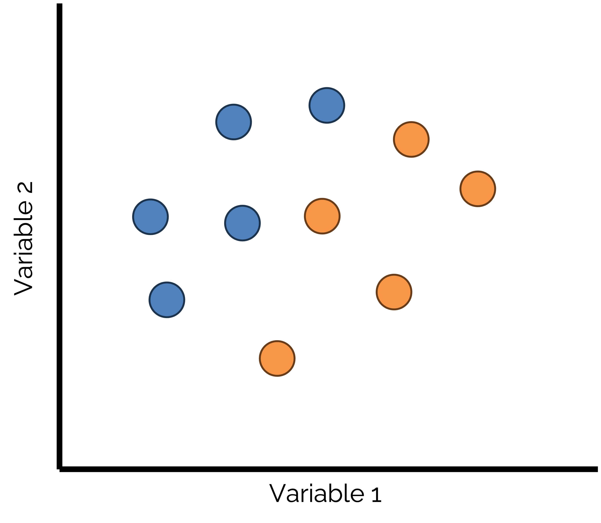{fig-align="center"}

## What is it?

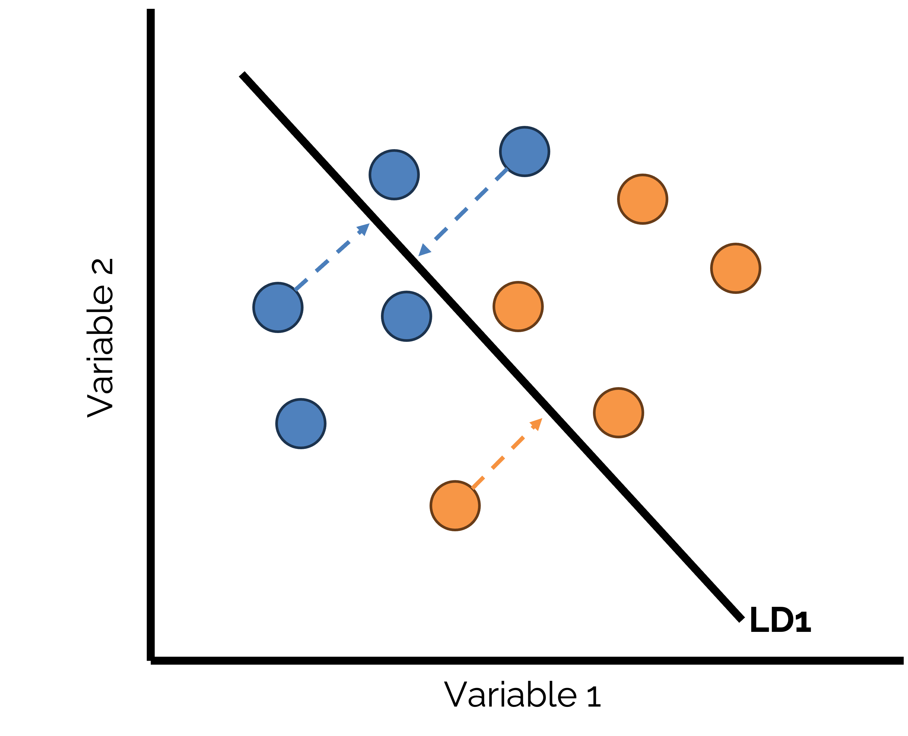{fig-align="center"}

## What is it?

{fig-align="center"}
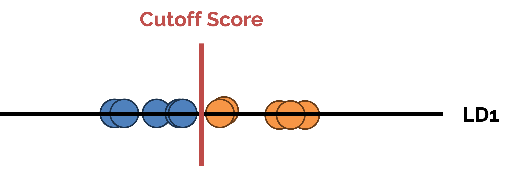{fig-align="center"}

## What is it?

* Each **linear seperator** is simply just a function of a line. 

$$
Z = b + m1(x1) + m2(x2)
$$

* This is a **discriminant function**.
  * Function number =  1 - # of groups

* We use the value of $z$ to compare to the cutoff point - AKA decide which group one is in.

* Comparison is made with a multivariate distance - **Mahalanobis distance** $D^2$

##

$$
GOL(187)*0.11 + XCB(142)*0.107 – 17.019 = 0.286
$$

##

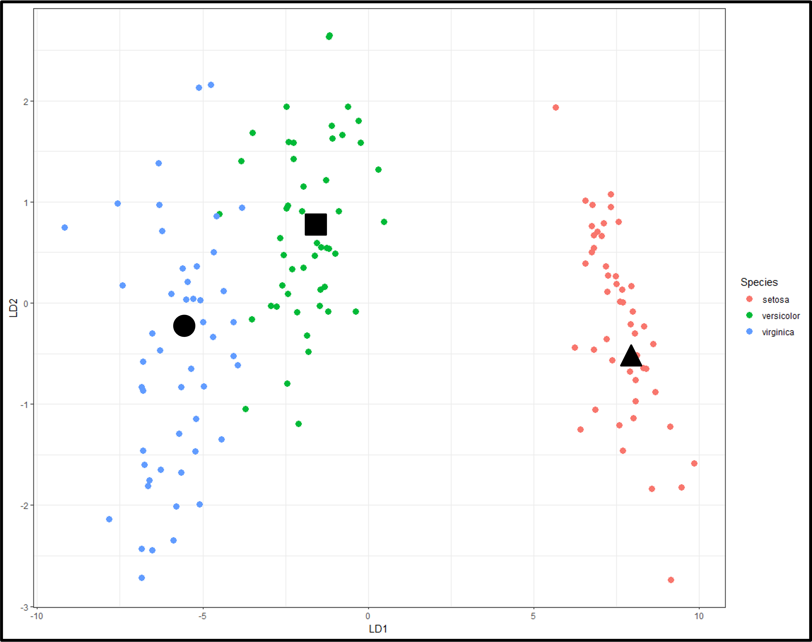{fig-align="center"}

## Mahalanobis Distance

* Multivariate distance metric
  * A euclidean distance in 3D using the covariance matrix.

* Adjusts for correlated data. 
  * Similar to PCA EXCEPT we maximize between group variance NOT total data variance. 
  
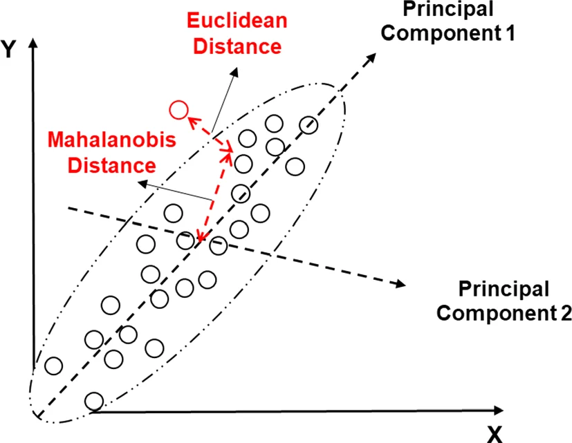{fig-align="center"}

##

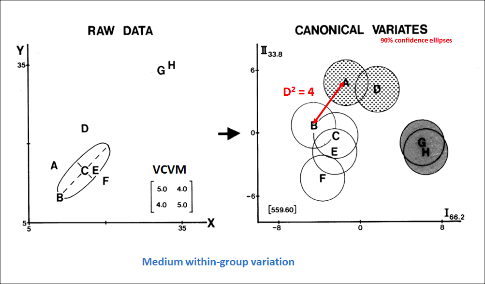{fig-align="center"}

## Assumptions {.smaller}

***One output variable (group/factor) and many continuous input variables***

1.  Each case is from a mutually exclusive group
2.  Input variables are not collinear
3.  Homogeneity of variance between output groups
4.  Multivariate normally distributed samples
5.  Sufficient sample size: The smallest sample size should be 3x the number of input variables
    * Ex: 20 input/predictor variables is n≥60, per group 

## How an LDA works

* The Mahalanobis D2 examines the squared distance from an individual case to the group centroid
* An individual will be classified into the group with the lowest D2
* An individual will be forced to classify into a group, even if the actual group is not in the reference data or if it is far from all centroids
    * Reference data is important!
* Data are always scaled before being used!

## DFA vs. Logistic

* Can discriminate between >2 groups
* Performs much better when groups are well-separated
* More stable for small sample sizes

## DFA in R

```{r}
#| echo: true
#| message: false

library(MASS) #LDA
library(tidyverse)
library(magrittr)

data("iris")
iris2 <- iris
names(iris2) <- c("sl","sw","pl","pw","species")
iris2 %<>% mutate_at(names(iris2)[-5], scale)  # don’t forget to scale!

```

##

```{r}
#| echo: true

iris_lda <- lda(species ~., data=iris2)  # what does ~. mean?
iris_lda

```

## Remember, DFA is Predictive!

```{r}
#| echo: true

# pred <- predict(iris_lda, newdata = ...)
pred <- predict(iris_lda)
names(pred)
```

* ***Class***: class or group each row is classified into.

* ***Posterior***: Posterior probablity of belonging to each group

* **x** is values of each discrimnant score in standardized space.

##

```{r}
#| echo: true

head(pred$class)

head(pred$posterior)

head(pred$x)
```


##

```{r}
#| echo: true

plot(iris_lda)

```

##

```{r}
#| echo: true

all_iris <- cbind(pred$x, iris2)

p <- ggplot(all_iris, aes(x=LD1, y=LD2)) + 	theme_bw() + 	geom_point(aes(color=species), 	size=3) + 	
	stat_ellipse(
	aes(linetype=species)) + 	
	labs(x="CV Score 1 (99%)", 
	y="CV Score 2 (0.8%)", 	color="Species", lty="Species")

```

##

```{r}
#| echo: true

p
```

## Add Centroids

```{r}
#| echo: true

# Calculate centroids:
ld1 <- pred$x[,1] 
ld2 <- pred$x[,2]

cent <- data.frame(matrix(nrow=3, ncol=3))
names(cent) <- c("species","LD1","LD2")
specs <- as.character(unique(iris2$species))

for(s in 1:3) {  
	cent[s, "species"] <- specs[s]  
	cent[s, "LD1"] <-sum(ld1*(iris2$species==specs[s]))/sum(iris2$species==specs[s])  	
	cent[s, "LD2"] <- sum(ld2*(iris2$species==specs[s]))/sum(iris2$species==specs[s])
}

cent

```

##

```{r}
#| echo: true

# Add Centroids to Plot:
p + geom_point(data=cent, aes(x=LD1, y=LD2, 	shape=species), size=6) + 
	guides(shape="none")

```

## Classification Tables

```{r}
#| echo: true

# Create a contingency table with known(rows) and predicted (cols)
ct <- table(pred$class, iris2$species)
ct

# Calculate the percent correct for each species:
diag(prop.table(ct, 1))

# Sum the diagonal proportions for overall correct classification:
sum(diag(prop.table(ct)))

```

## Confusion Matrices!

```{r}
library(caret)
confusionMatrix(ct)
```

# Decision Trees and Ensemble Learners

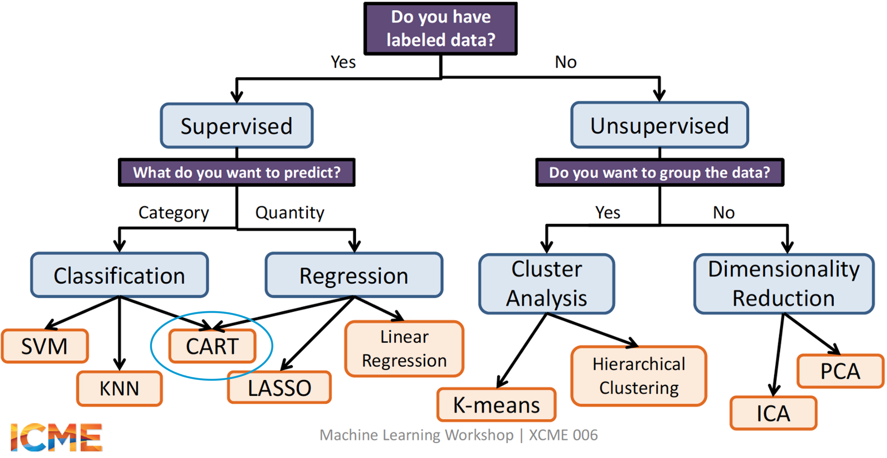{fig-align="center"}

## Tree-Based Methods{.smaller}

::::{.columns}

:::{.column width = "50%"}

> a class of supervised learning algorithms that use a tree-like structure to partition data into smaller subgroups for prediction.

* Supervised

* Can be used in regression or classification

* Can be a single tree or an ***ensemble*** learner
  *  An ensemble combines several 'lesser' methods into a more optimal model. 

:::

:::{.column width = "50%"}

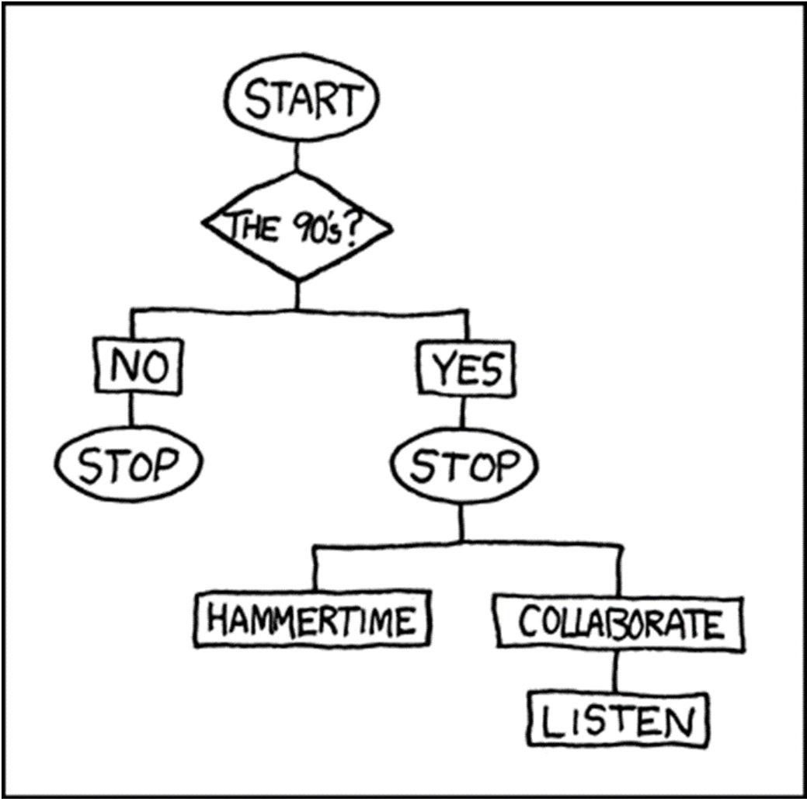{fig-align="center"}

:::

::::

## Tree-Based Methods{.smaller}

::::{.columns}

:::{.column width = "70%"}

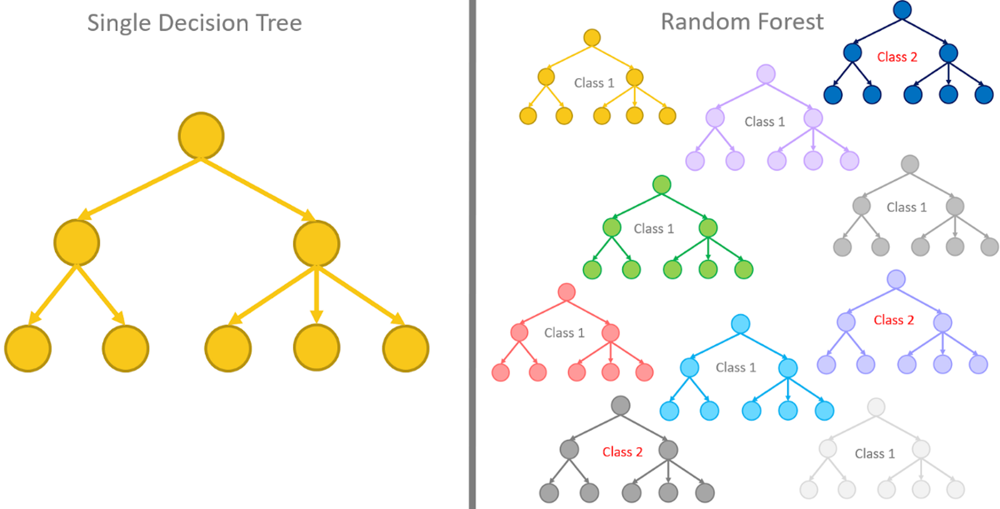{fig-align="center"}

:::

:::{.column width = "30%"}

* Simple & Easy to interpret

* Data scaling unnecessary

* Less assumptions
  * Non-linear
  * Mixed data
  * Non-normal

:::

::::

## Decision Trees

* Segments the predictor space into simplified rectangular regions

* Balance between classification accuracy and over-fitting the data.

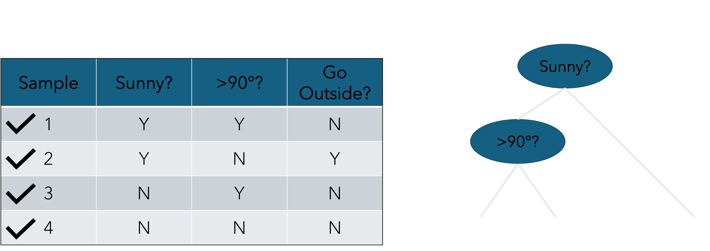{style="background-color: steelblue; padding: 10px;"}

## Most Important Decision? 

***How do we determine where to split the data???***
\

* Decision trees are ***greedy!***
  * Each step looks at all of the data and makes the best decision based on that single step. The next (or previous) is independent of this decision.
  * Recursive process
  
* In **regression problems:** *minimize the residual summed squares (RSS)*.

* In **classification problems:** *Gini ("Impurity") Index*.

* There are MANY others...

## Caution!

* ***Unlimited flexibility***: decision trees can keep growing until there is one leaf for every single observation
  * They tend to **overfit** the data!
  * To prevent this, we often employ *pruning* of trees, where we set limitations on how big a tree can grow

* ***High variance***: trees can be trained on two random parts of data and produce drastically different results

* ***Low variance***: similar results are produced if repeated on distinct data sets

## Decision Trees in R{.smaller}

```{r}
#| echo: true
#| message: false

# Install if needed

library(tidyverse)
library(caret) # Classification and Regression Trees
library(randomForest) # Ensemble Approaches
library(rpart.plot) # Plotting Trees
library(mlbench) # Testing Trees

```

Say we are interested in classifying Olduvai Tools by their Material, given XRF results: 

```{r}
#| echo: true

data <- read.csv("data/olduvai-xrf.csv")
data$Material <- factor(data$Material)
summary(data)

```


## Step 1: Splitting Data

Whenever we are preparing models to be used in a predictive and/or classification capacity (as opposed to inference)...


**We must train the model and, assuming larger samples, we must test it on unseen data. This is part of a larger process called [cross validation]{.underline}**

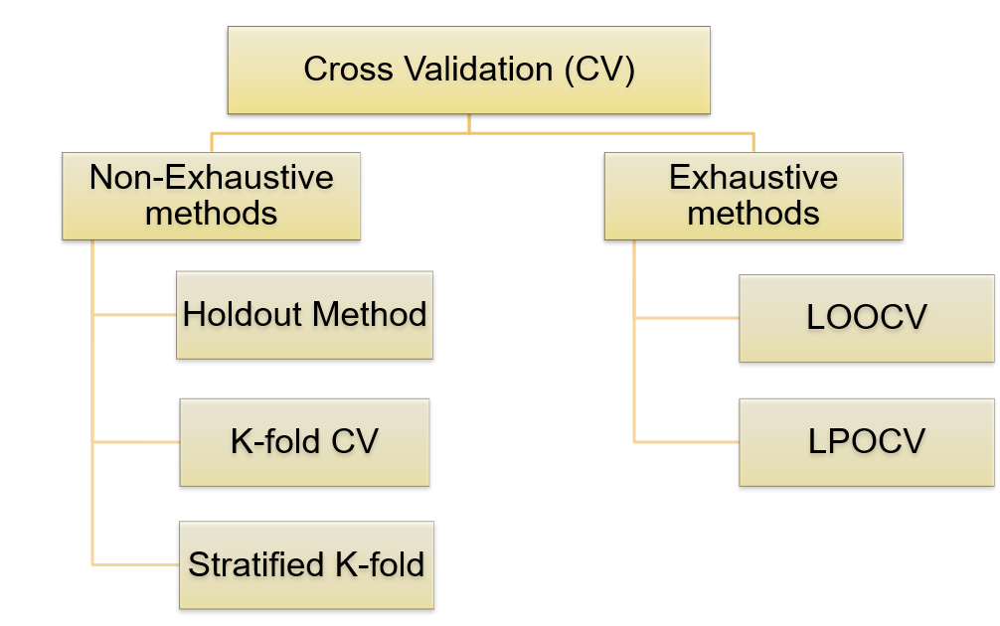{fig-align="center"}

##

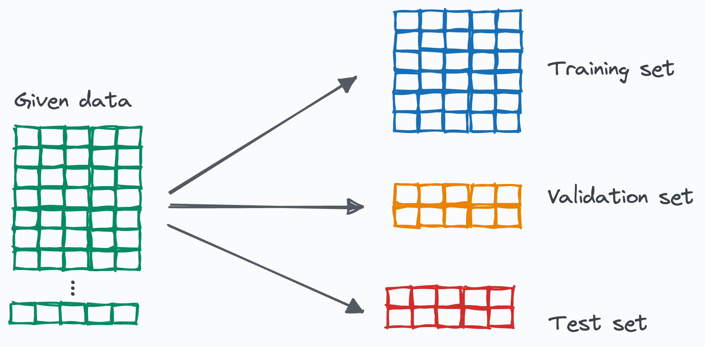{fig-align="center"}

## Splitting Data in R

**This is a random process!**

```{r}
#| echo: true

set.seed(123)
idx <- createDataPartition(data$Material, p=0.8, list=F)

```

* Selects 80% of the data, keeping the same proportion of Materials as are in the original data

* Returns a matrix of row numbers!

## Splitting the Data in R

```{r}
#| echo: true

# Create training and testing set using idx
train <- data[idx, ] # idk are row indices!
test <- data[-idx, ]

# Inspect the new training and testing sets
summary(train$Material)

summary(test$Material)

```

## Decision Tree in R

```{r}
#| echo: true

tree_model <- train(Material ~., data=train[-c(1,2)], 
	method="rpart",
	trControl = trainControl("cv", number=10),
	tuneLength=10)

```

* `data=train[-c(1,2)]` to remove `Type` and `Source` columns

* `method = rpart`: Recursive Partitioning - this is the tree argument

* `trControl = trainControl("cv", number=10)` A cross-validation technique to generalize the model.

* `tuneLength=10` in this code, this stands for something call `mtry`, which is the number of variables tested at each split.

## Decision Tree in R{.smaller}

::::{.columns}

:::{.column width = "50%"}

* cp: complexity parameter aka how complex the tree is; lower is better

* kappa: agreement between predicted and truth; higher is better (adjusts for chance)

* Accuracy: Correct vs. incorrect; higher is better

* Final model is selected based on a compromise between cp, accuracy, and kappa value

:::

:::{.column width = "50%"}

```{r}
#| echo: true

tree_model
```

:::

::::

## Plotting the Tree in R

```{r}
#| echo: true

par(xpd=NA)  # expands the plot window
plot(tree_model$finalModel)
text(tree_model$finalModel, digits=3)
```

## Rpart plots

```{r}
#| echo: true

rpart.plot(tree_model$finalModel)

# For more information and the flexibility of rpart.plot(): http://www.milbo.org/rpart-plot/prp.pdf

```

## Testing the Tree in R

```{r}
#| echo: true

# Use our test set to see how well our tree performs:
tree_pred <- tree_model %>% predict(newdata=test)

head(tree_pred)

# Calculate the testing accuracy***
mean(tree_pred == test$Material)

```

##

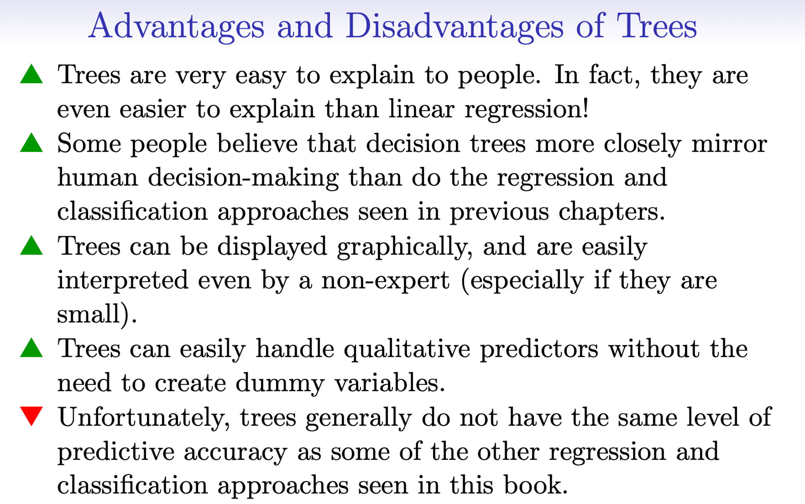{fig-align="center"}

## Decision Trees to Ensemble Learners

* Decision Trees == One attempt, One Tree
* Ensemble Learning == Multiple Tests Working Together
  * **Forest == Multiple Trees** Working Together as an Ensemble!
* Each individual tree in the forest provides a class prediction
  * Uncorrelated trees create a Committee, where Majority Rules

##

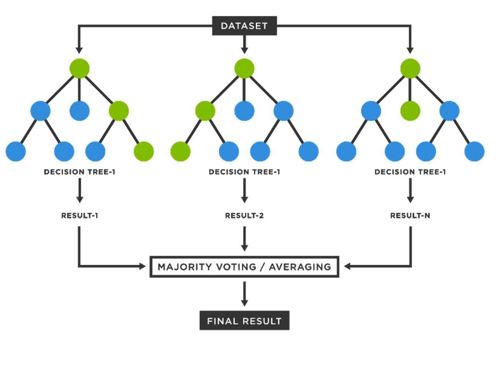{fig-align="center"}

## Bagging Trees

* Random Forest is comprised of uncorrelated trees because it uses **bootstrap aggregation aka bagging**

* Each tree is trained on a different subset of the training data, and the final outcome is the Average or Mode of all trees

* Averaging the predictions and bagging the training sample yields low variance aka reduces overfitting

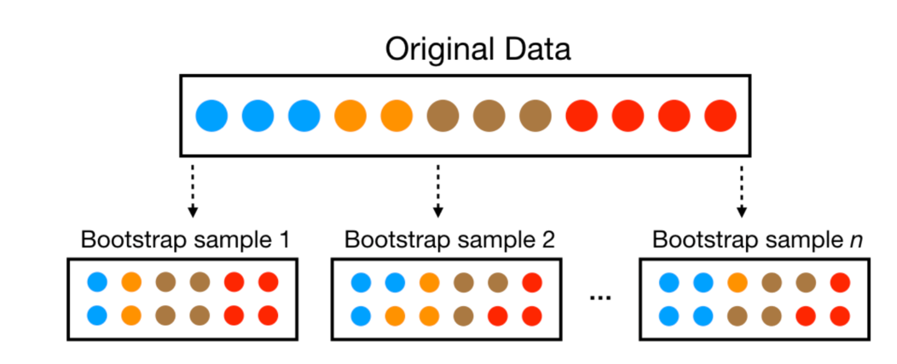{fig-align="center"}

## Things to Know

* The goal is to minimize *out-of-bag* error. AKA error on unseen bootstrapped samples.

* A series of *bagged* trees == **Forest**

* A forest is **Random** due to a random subset of features tested at each split.
  * The user sets (or finds) the optimal `mtry: the number of random features picked to try at each split`
  
* Only a subset of all features are considered for each node
  * removes complications of strongly correlated features
  * Uncorrelated Forests!
  
## Random Forest in R

```{r}
#| echo: true

# Set your seed for reproducibility
set.seed(2024)
rf_model <- train(Material ~., data=train[-c(1,2)],
		method="rf", # the only change from the decision tree
		trControl=trainControl("cv", number=10),
		tuneLength=10)

```

## Random Forest in R{.smaller}

::::{.columns}

:::{.column width = "50%"}

* mty: number of random features

* kappa: agreement between predicted and truth; higher is better (adjusts for chance)

* Accuracy: Correct vs. incorrect; higher is better

* Final model is selected based on a compromise between mtry, accuracy, and kappa value

:::

:::{.column width = "50%"}

```{r}
#| echo: true

rf_model
```

:::

::::

## Examine Final Model

```{r}
#| echo: true

rf_model$finalModel

```

## Plotting...

**You cannot plot a forest!**

> Instead you inspect the variables that are most important or informative to prediction / classification.

```{r}
#| echo: true

vi <- varImp(rf_model$finalModel)
vi

```

##

```{r}
#| echo: true

# Round values to remove scientific notation
vi <- round(vi, digits=2)

# Re-order variable importance from highest to lowest
vi[order(-vi$Overall), 1, drop=F]

```

## Plot the Variable Importance

Remember, the default splitting algorithm is the **Gini Impurity Index: the probability of misclassifying an observation**

* A decrease in GINI signifies a decrease in the probablity of misclassifying. 


```{r}
#| echo: true

# Plot the variable importance
varImpPlot(rf_model$finalModel)

```

## Testing the Forest in R

```{r}
#| echo: true

# Use our test set to see how well our forest performs:
rf_pred <- rf_model %>% predict(newdata=test)

head(rf_pred)

# Calculate the testing accuracy***
mean(rf_pred == test$Material)

```

## How Many Trees in a Forest?

* The default value for number of trees is 500

* To change that value to 1000, use the argument `ntree=1000` within the `train()`

* There is a trade-off between computation time and performance

* The less number of trees, the more likely observations in the training data are not sampled for tree construction
(Usually) not a big difference when ntrees > 1000, although this is data-dependent

## Summary

* Trees are easy to interpret, but prone to over-fit your training data

  * Random Forests mitigate overfitting

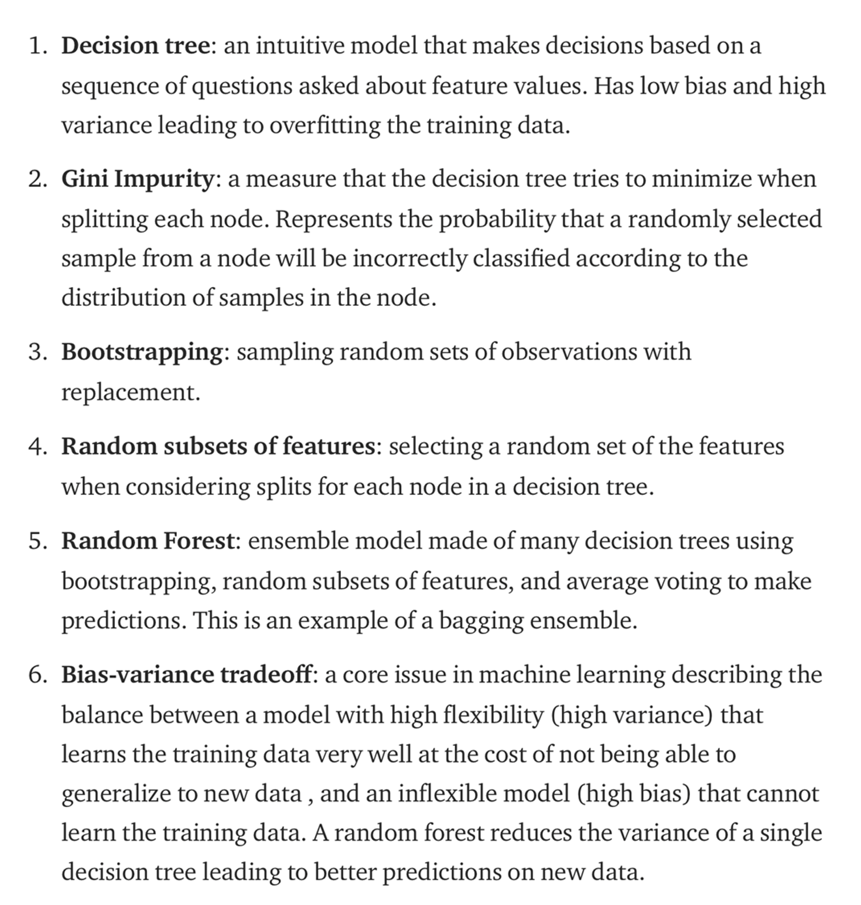{fig-align="center"}

##

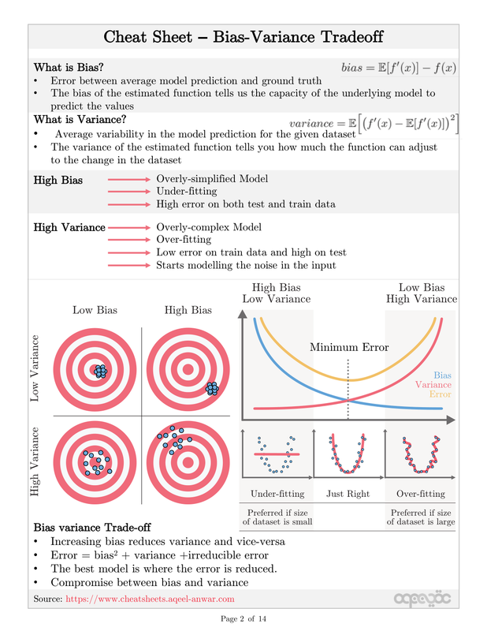{fig-align="center"}