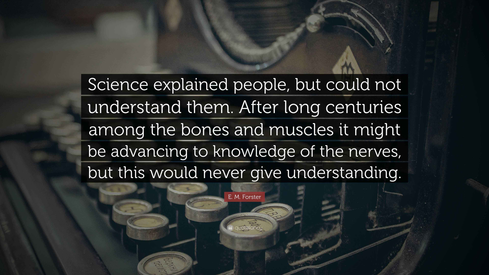
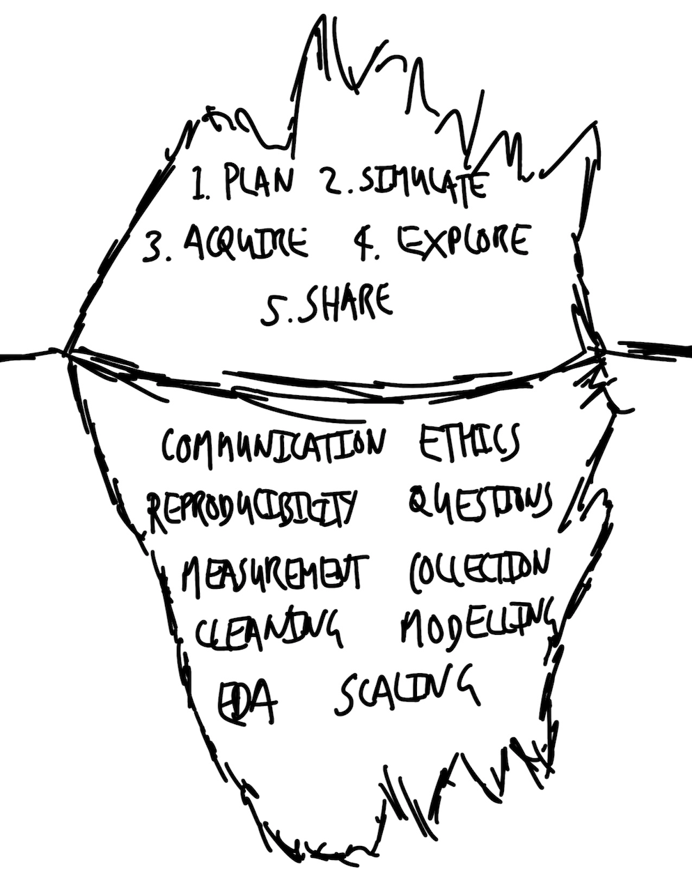
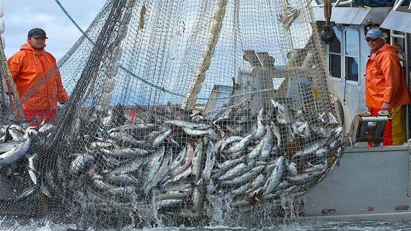
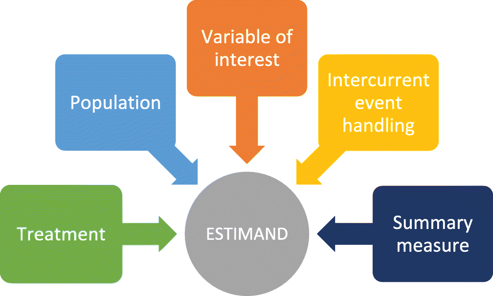
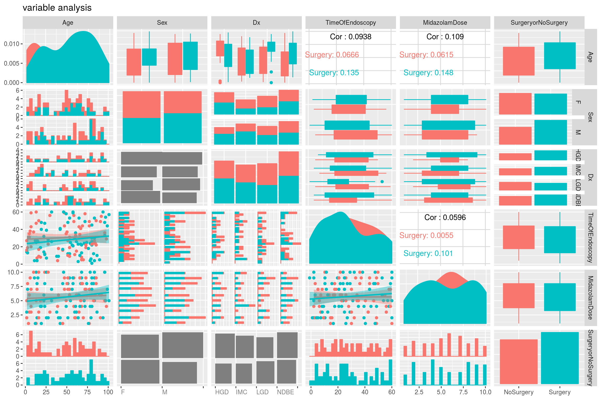
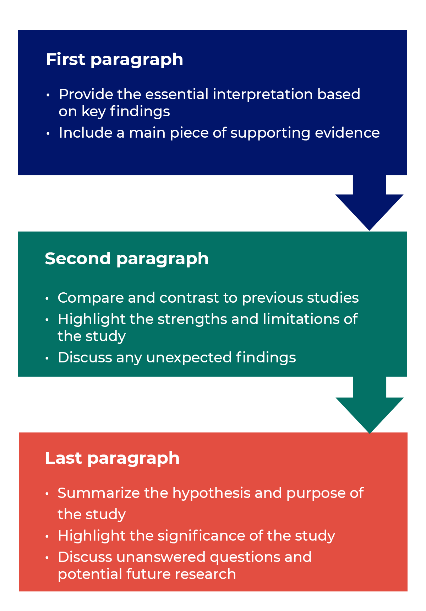

## Important Dates and Reminders{.smaller}

* Any outstanding assignments must be turned it by **11:59PM on 5/4**.

* The final presentations are on 5/4 from 8-10:30AM.

* All associated documents must be turned in by **11:59PM on 5/4**.
  * Github (or Canvas)

* The final practical is due **5/6 by 11:59PM**

* Office Hours:
  * Cancelled today.
  * Normal on Wednesday.
  * I will be in the office throough graduation and until the 14th.

## Final Practical Thoughts

1. Keep your quarto clean and organized.
    * i.e., in your chunks you could set `#| message: false` when loading packages.
  
2. Please check to make sure all chunks run ***before*** the final render, commit, and push. 

3. Use the quarto cheatsheet (and the assignments from all semester) to keep your file organized. 

4. Remember, render, then commit, then push. Go to github. Check to make sure it is all there and opens. 

# 

1. What are data?

2. What story are ***you*** telling?

#

> How do we connect the medium to the substrate?

## On Telling Stories{.smaller}

* Your goal: ***tell a convincing story***


1. What is the dataset? Who generated the dataset and why?

2.  What is the process that underpins the dataset? Given that process, what is missing from the dataset or has been poorly measured? Could other datasets have been generated, and if so, how different could they have been to the one that you have?

3. What is the dataset trying to say, and how can you let it say this? What else could it say? How do you decide between these?

4.  What are you hoping others will see from this dataset, and how can you convince them of this? How much work must you do to convince them?

5.  Who is affected by the processes and outcomes, related to this dataset? To what extent are they represented in the dataset, and have they been involved in the analysis?

##

{fig-align="center"}

# Workflow Components

## Plan

**Plan** and sketch an endpoint.

{fig-align="center"}

## Simulate

**Simulate** and consider the simulated data.

```{r}

# 1. Install and load the necessary package
library(deSolve)

# 2. Define the SIR model function
sir_model <- function(time, state, parameters) {
  with(as.list(c(state, parameters)), {
    N <- S + I + R
    # Differential equations
    dS <- -beta * S * I / N
    dI <- beta * S * I / N - gamma * I
    dR <- gamma * I
    
    return(list(c(dS, dI, dR)))
  })
}

# 3. Set initial conditions and parameters
# Total population
N <- 10000 
# Initial infected, Recovered
init <- c(S = N - 3, I = 3, R = 0) 
# Time to simulate (days)
times <- seq(0, 100, by = 1) 
# beta = infection rate, gamma = recovery rate (1/days_infectious)
params <- c(beta = 0.4, gamma = 0.1) 

# 4. Run the simulation
output <- ode(y = init, times = times, func = sir_model, parms = params)
output <- as.data.frame(output)

# 5. Visualize the results
plot(output$time, output$I, type = "l", col = "tomato", 
     xlab = "Days", ylab = "Number of People",
     main = "Simple COVID-19 SIR Simulation", ylim = c(0,10000), lwd=2)
lines(output$S, col = "steelblue", lwd = 2)
lines(output$R, col = "goldenrod", lwd=2)
legend("topright", legend=c("Infected", "Susceptible", "Recovered"), 
       col=c("tomato", "steelblue", "goldenrod"), lty=1)

```


## Acquire

**Acquire** and prepare the actual data.

***PS: THIS IS HARD!***

{fig-align="center"}

## Explore

**Explore** and understand.

 {fig-align="center"}
 
## Share

We must **share** our results. 

{fig-align="center"}

## Tip of the Iceberg

{fig-align="center"}

## How do our worlds become data?

{fig-align="center"}

## Enter Data Science

> "humans measuring things, typically related to other humans, and using sophisticated averaging to explain and predict."

* Data are generated.
  * Data are *sui generis* [a class by itself]
  
* Failure will happen. 

* There is no perfect analysis. 

# Communicating Scientific Research

> If you want to be a writer, you must do two things above all others: read a lot and write a lot. There’s no way around these two things that I’m aware of, no shortcut.

##

{fig-align="center"}

## Asking Questions

1.  Data-first

2.  Question-first

## Data First

1. Theory

2.  Importance

3.  Availability

4.  Iteration

\

* **Think about the data you [do not]{.underline} have**

## Question First

FINER Framework

* **Feasible**

* **Interesting**

* **Novel**

* **Ethical**

* **Relevant**

* ***The nature of the question being asked matters less than being genuinely interested in answering it.***

## Answering Questions

* Create counterfactuals.

{fig-align="center"}

## Answering Questions

* Consider your estimands.

{fig-align="center"}

## Answering Questions

* Consider relationships.

```{dot}
digraph D {

  node [shape=plaintext, fontname = "helvetica"];
  
  a [label = "Income"];
  b [label = "Happiness"];
  c [label = "Children"];
  
  { rank=same a b};
  
  a->{b, c};
  c->b;
}
```

# Components of a Quantitative Paper

## Title

Your first opportunity to engage with the reader!

Informative, clear, meaningful.

One example: "Exciting content: Specific content"

*"Returning to their roots: Examining the performance of Vote Leave in the 2016 Brexit referendum"*

## Abstract

1.  An introductory sentence that is comprehensible to a wide audience.
2.  A more detailed background sentence that is relevant to likely readers.
3.  A sentence that states the general problem.
4.  Sentences that summarize and then explain the main results.
5.  A sentence about general context.
6.  And finally, a sentence about the broader perspective.

## Introduction

**It must be self-contained!**

Start broad. Do no dive into the jargon. Why should a reader care?

Situate your study. Why is what **you** are doing important?

What is your work addressing?

## Data

{fig-align="center"}

## Model

1. Provide enough information to completely describe the results. 

2.  A reader should understand and be able to reproduce your results. 

3. Jargon is **not** your friend. If you say it, you must define it. 

4. Stick to the facts. Justify those facts. Remember, "all models are wrong, but some are useful"

## Results

The most ***boring*** part of writing. 

Avoid any and all interpretation. 

Again, **stick to the facts.**

Remember the **story.**

## Discussion

{fig-align="center"}

## Rules to follow

1.  Focus on the reader and their needs. Everything else is commentary.

2.  Establish a structure and then rely on that to tell the story.

3.  Write a first draft as quickly as possible.

4.  Rewrite that draft extensively.

5.  Be concise and direct. Remove as many words as possible.

##

6.  Use words precisely. For instance, stock prices rise or fall, rather than improve or worsen.

7.  Use short sentences where possible.

8.  Avoid jargon.

9.  Write as though your work will be on the front page of a newspaper.

10. Never claim novelty or that you are the “first to study X”—there is always someone else who got there first.


## Words to Live By{.smaller}

1.  Data analysis is computer programming.

2.  No data analyst is an island for long
    * Code is communication.
    * Code to communicate.
  
3.  The territory of a data analyst requires maps.
    * Meaningful code requires data.
    * File organization can be a map itself.

4. Version control prevents clobbering, reconciles history, and helps organize work

5.  Testing minimizes error

6. Work can be reproducible

7. Research ought to be credible communication

* *All from Bowers and Voors, 2016*

## Next Steps.

***Telling Stories with Data [Chapter 17](https://tellingstorieswithdata.com/17-concluding.html)***

* More specific classes.

* Continued coding.

* Continued writing.

## Parting Thoughts

* Teaching coding + statistics may not be best for everyone.
* What matters most is you understand what to run, why, and how to interpret.
* This class will change.

