# Statistical Inference

Drawing conclusions about a **population** based on information obtained from a **sample**.

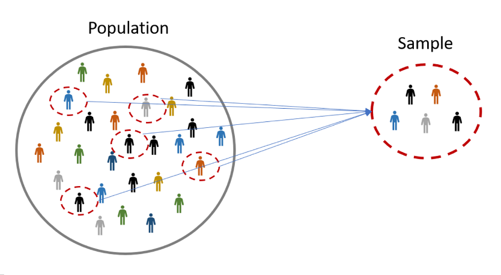

## The What

***Estimand***

* Quantity to be estimated in statistical analysis.

Types

1.  An ***unobserved*** quantity directly related to the process of interest. [i.e., prediction]

2.  **Parameters** that govern the underlying process but are not direrctly observable (i.e., mean and sd)

##

 

::: {.r-fit-text}
$$Y = \beta X + \epsilon$$
:::

## Breaking It Down {auto-animate=true}

::: {.fragment .fade-in-then-semi-out}
$${\color{#4FC3F7}{Y}} = \beta X + \epsilon$$

::: {.callout-note icon=false}
### 👁️ $Y$ — The Outcome
$Y$ is what we **observe directly** in the world.  
It's real, measurable, and varies across individuals or cases.  
Think of it as the **data we actually collect**.
:::
:::

## Breaking It Down {auto-animate=true}

::: {.fragment .fade-in-then-semi-out}
$$Y = {\color{#FF8A65}{\beta}} X + \epsilon$$

::: {.callout-note icon=false}
### 🔒 $\beta$ — The Parameters (Unobserved, Indirect)
$\beta$ is **never directly seen** — we can only *estimate* it from data.  
It represents the **true relationship** between $X$ and $Y$ in the population.  
We infer $\beta$ indirectly through the data we collect.
:::
:::

## Breaking It Down {auto-animate=true}

::: {.fragment .fade-in-then-semi-out}
$$Y = \beta X + {\color{#CE93D8}{\epsilon}}$$

::: {.callout-note icon=false}
### 🌫️ $\epsilon$ — The Error (Unobserved Uncertainty)
$\epsilon$ captures everything we **didn't measure or can't explain**.  
It is unobserved — we never know it directly.  
It represents the **irreducible randomness** in the world.
:::
:::

# {.center}

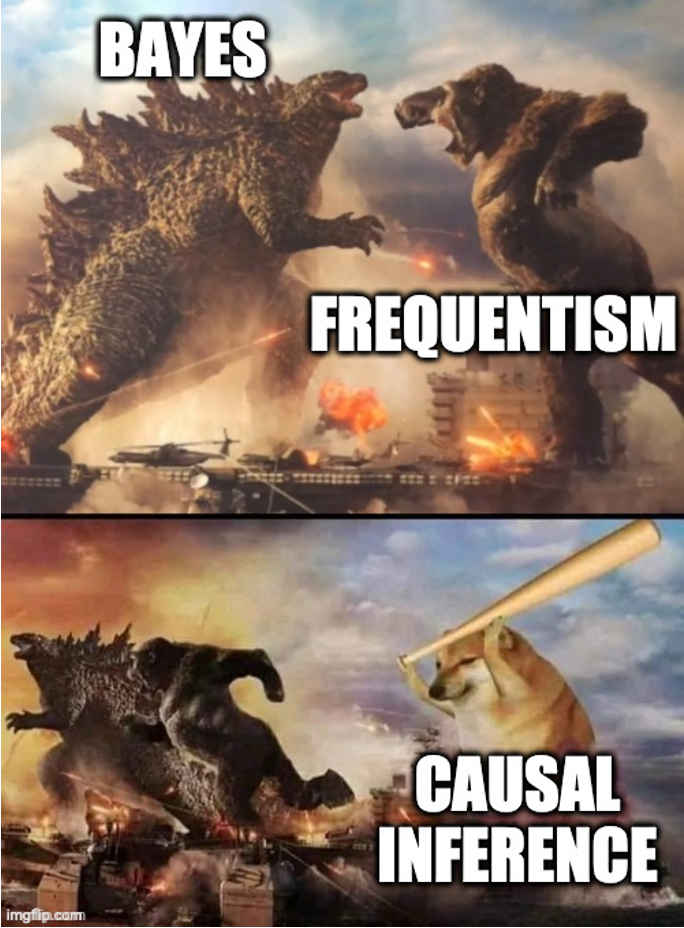{fig-align="center"}

## Science before Statistics

* For ***statistical models*** to produce scientific insight, they require additional **scientific models**

::::{.columns}

:::{.column width = "60%"}

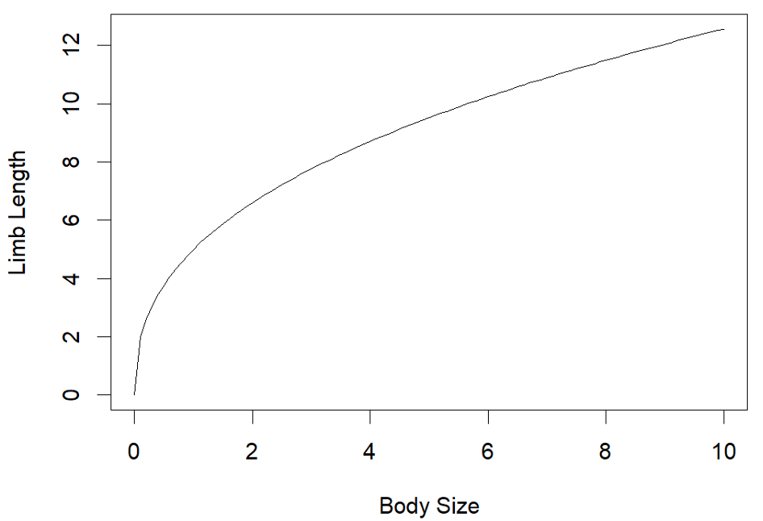
:::
:::{.column width = "40%"}

* Statistical Model
$$
y = kx^a
$$

* Scientific Model

$$
limb = k[body]^a
$$

:::

::::

# No cause in, No cause out

The reasons for statistical analysis are **not** found in the data themselves, but rather in the ***causes*** of the data.

* Data are meaningless in a vacuum.

## Causal Inference

::::{.columns}

:::{.column width = "60%"}

* There is more than **association** between variable.

* Causal inference is the **prediction** of *intervention*. 

* Causal inference is the **imputation** of *missing* variables.

:::

:::{.column width = "40%"}

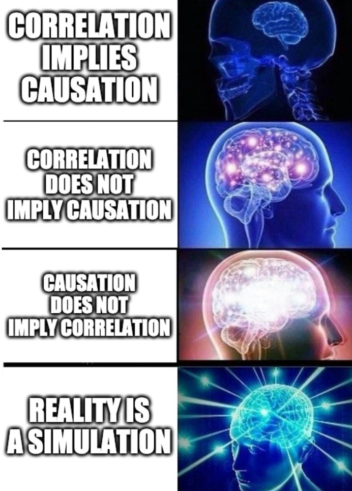

:::

::::

## Causal **Prediction**

* Knowing a ***cause*** means being able to predict the ***consequences*** of an [**intervention**]{.underline}.

* ***What if I do this?***

{fig-align="center"}

## Causal Imputation

* Knowing a **cause** means being able to construct unobserved **counterfactual** outcomes. 

* *What if I had done something else?*

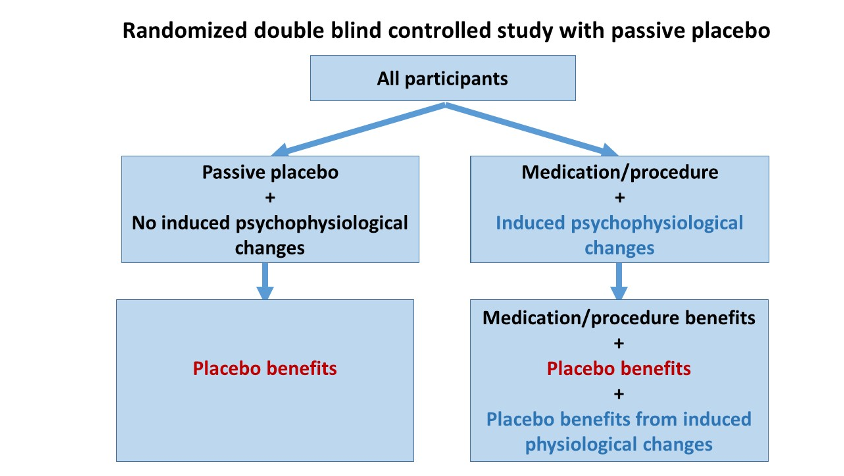{fig-align="center"}

##

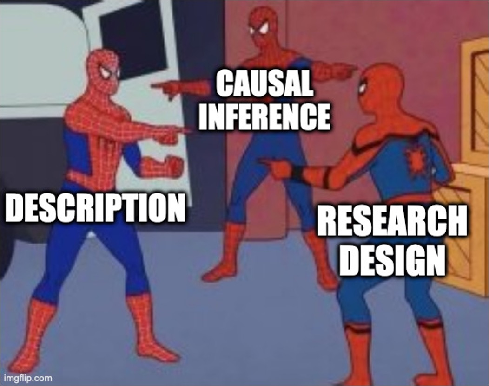{fig-align="center"}

# Causes are [not]{.underline} optional

* Even if **descriptive**, a causal model is necessary.

* The **sample** differs from the **population**
  * If we are going to describe the population we need causal thinking.
  
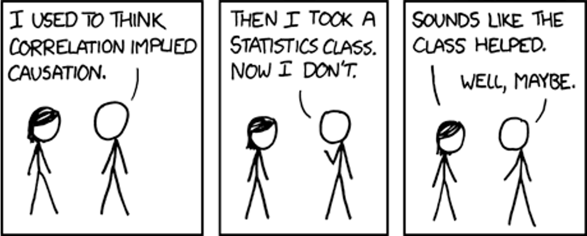{fig-align="center"}

## Directed Acyclic Graphs (DAGS)

* Heuristic model
* Clarify scientific thinking
* Can be used to deduce appropriate statistical models
* Arguably, step 1 to science and statistics

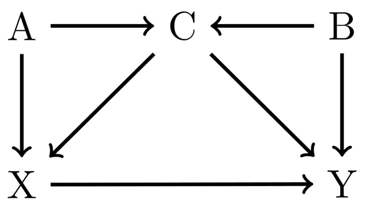{fig-align="center"}

# What are models?

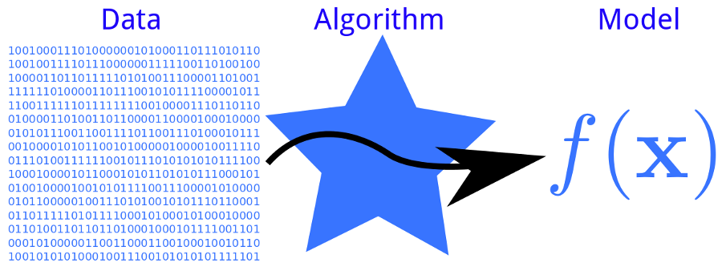{fig-align="center"}

##

{fig-align="center"}

## Statistical Golems

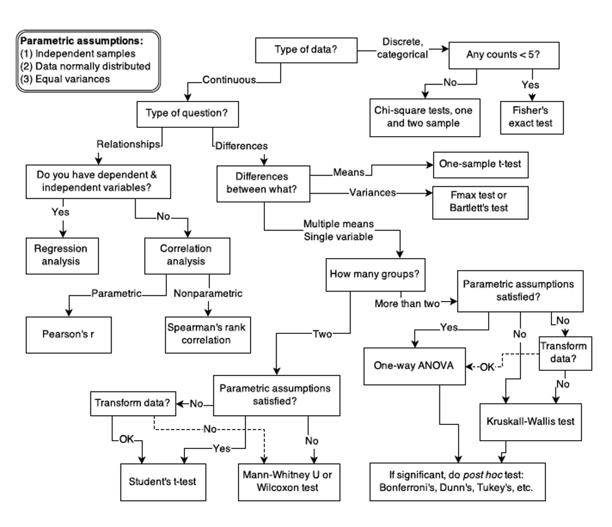{fig-align="center"}

## Issues

* Null models are rarely unique.

* It is [rare]{.underline} that any of us work in a setting where we can control all variables. 
  * We study observational systems!
  
* We know the process - but what is the null?
  * For example - $y = kx^a$. Is $x$ or $y$ ever 0 or null?
  
## Hypotheses and Models

* Research requires **more** than null robots. 

* It also requires ***generative causal models***
  *  Statistical model justified by generative models and questions with appropriate estimand. 
  
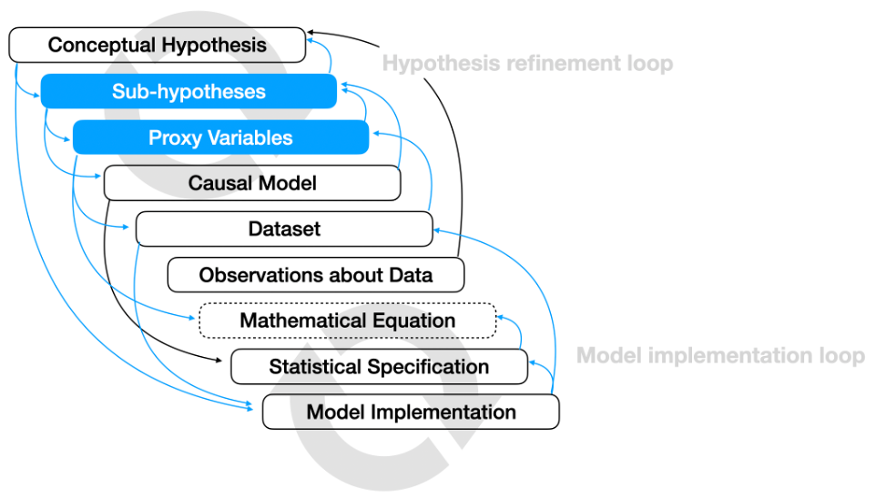{fig-align="center"}

## Finite Data, Infinite Problems

* A DAG is not enough.
  * Spend some time in thought about your generative model?
  * How do we deduce information?
  
* We need a strategy to derive estimates and uncertainty!

[**Statistics!**]{.underline}

* **Frequentist Approaches**
* [***Likelihood-Based Approaches***]
* **Bayesian Approaches**

#

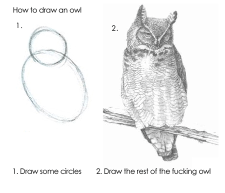{fig-align="center"}

# Your Statistics Owl

1.  Understand what you are doing.
2.  Document your work and reduce your error.
3.  Create and follow respectable scientific workflow.

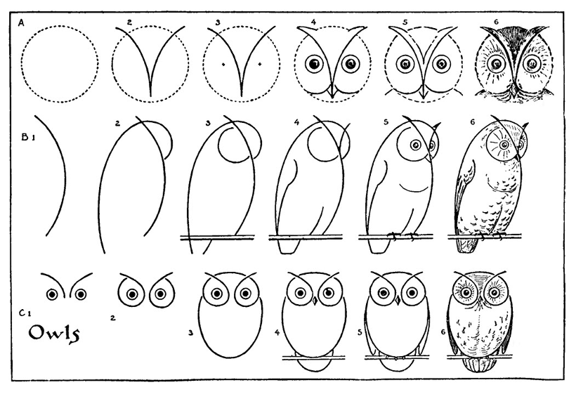{fig-align="center"}

# The Central Problem

$$
𝑦_1, \dots , 𝑦_𝑛  \sim 𝑃
$$

## What is **P**?

* 'Holy Grail' 

* A map or function describing your system of interest.

* **Probability:**  the likelihood of some event occurring.
* **Frequency:** count of how often an event may occur

**Probability** is how many times you [THINK]{.underline} something will happen, while **frequency** is how many times it [DID]{.underline} happen

##

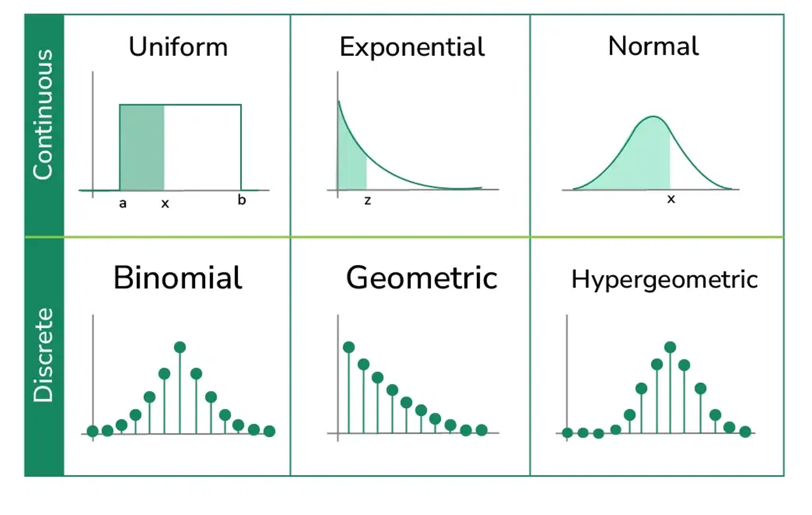{fig-align="center"}

##

$$
𝑦_1, \dots , 𝑦_𝑛  \sim 𝑃
$$

* Finding *real* $P$ is **difficult**.

* Instead we search for a [component]{.underline} of the system. 
  * **Parameters**
  
* Some functional $\psi(y)$
  * $\psi$ can be anything related to your question / system at hand. 
  
# Back to Scary Math

$$
f(x) = \frac{1}{\sigma\sqrt{2\pi}} e^{-\frac{1}{2}\left(\frac{x-\mu}{\sigma}\right)^2}
$$

## $\psi(y)$

::::{.columns}

:::{.column width = "50%"}

* Mean height = $\mu$
* Variation in height = $\sigma$
* The mean can be further decomposed into parts:
  * Male vs. female
  * Age
  * Ethnicity
* $\mu$ is a **function** of elements
  * $\mu = X\beta + \epsilon$

:::

:::{.column width = "50%"}

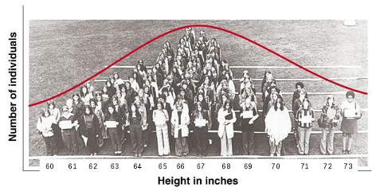{fig-align="center"}

:::

::::

## Putting it all together

\

$y \sim normal(\mu, \sigma)$

\

$\mu = X\beta + \epsilon$

\

$\sigma = \sqrt{\frac{\sum_{i=1}^{N} (x_i - \mu)^2}{N}}$

## What's our goal?

* Prediction
  * Find some function of $x$ than predicts the outcome $y$.
  * Less concerned with individual parameter values.

* Inference
  * Describe properties that govern the system.
  * More concerned with individual parameter values.

## Methodological Differences {.smaller}

::::{.columns}

:::{.column width = "40%"}

:::

:::{.column width = "60%"}

**Frequentist**

* Option 1: Your answer is based on the frequency of events

\

\

**Bayesian**

* Option 2: Your answer is based upon your degree of belief in your data AND the system at hand.

:::

::::

## Methodological Differences

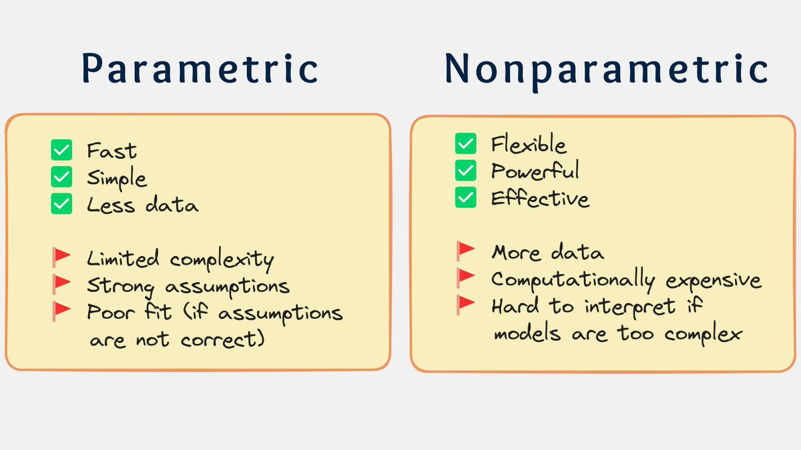

## Tradeoff

\

**Complexity vs. Accuracy vs. Interpretability**

\

::::{.columns}

:::{.column width = "50%"}

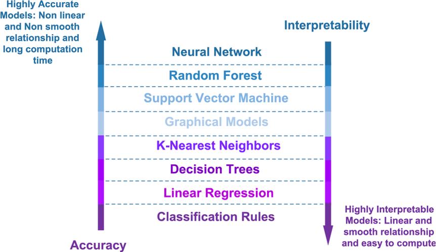

:::

:::{.column width = "50%"}

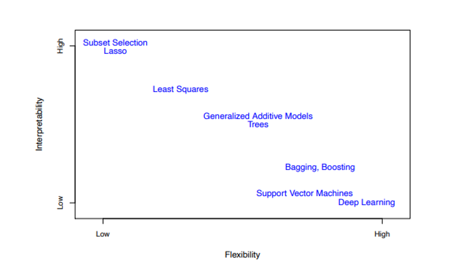

:::

::::

## Supervision vs. Unsupervision

::::{.columns}

:::{.column width = "50%"}

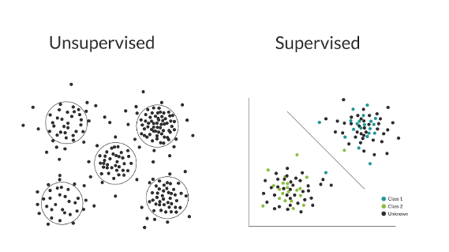

:::

:::{.column width = "50%"}

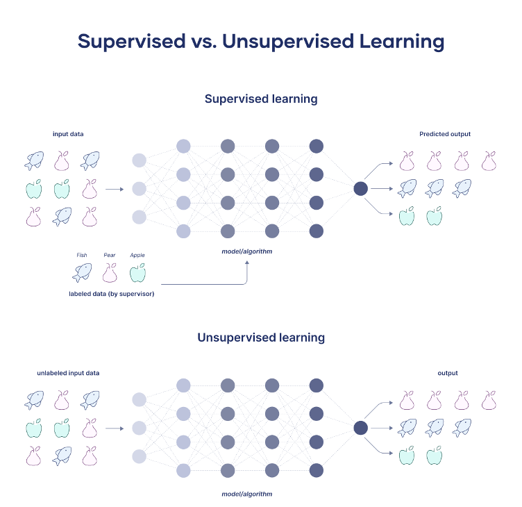

:::

::::

## Classification vs. Regression

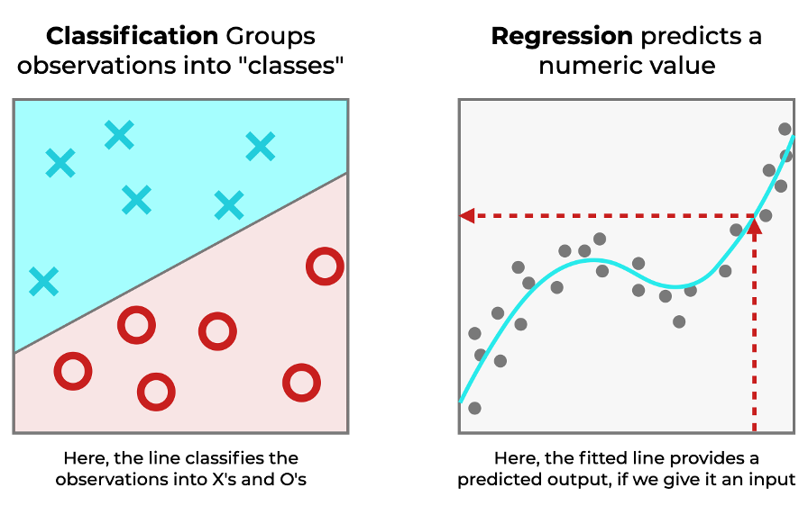
