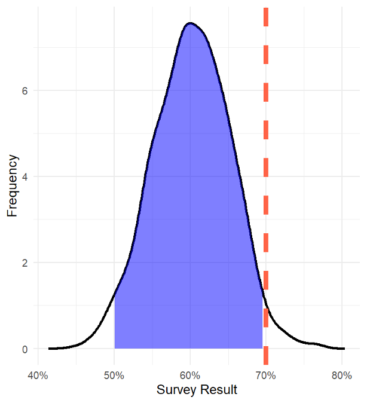
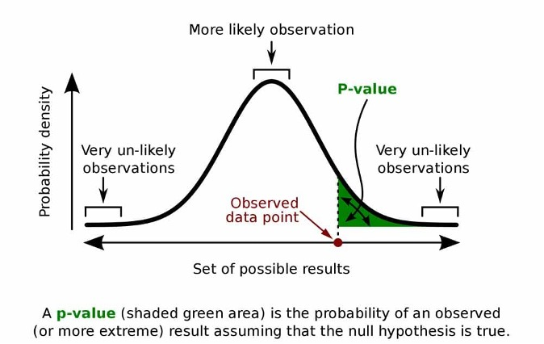
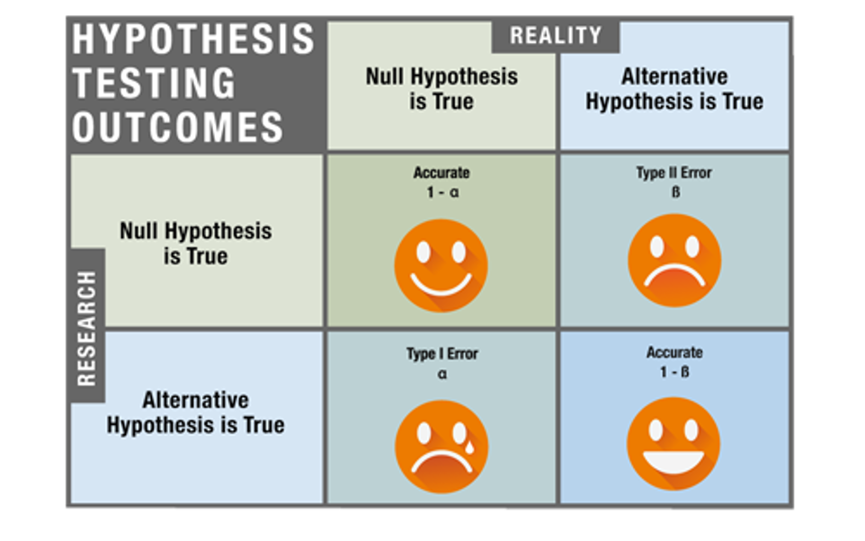
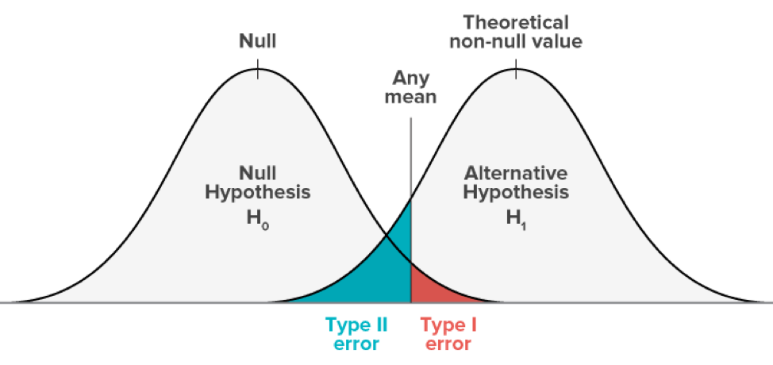
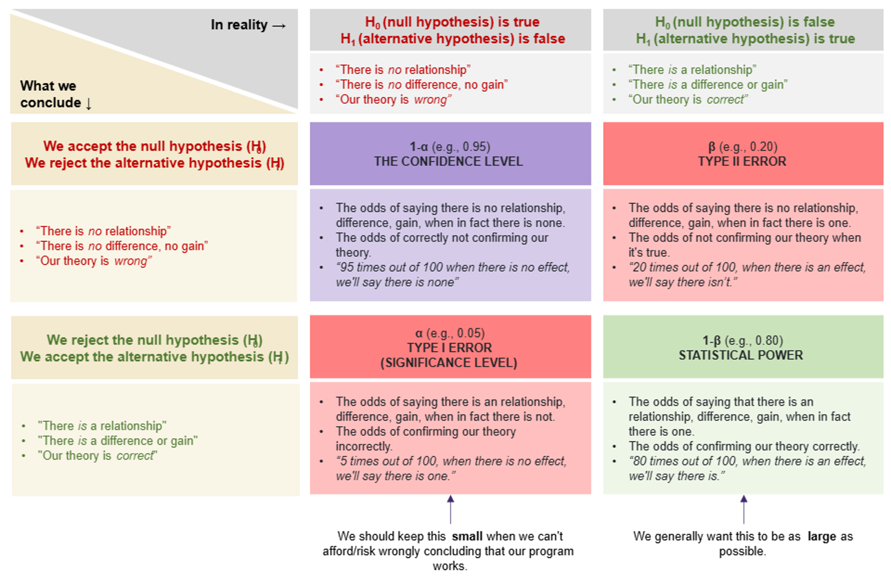
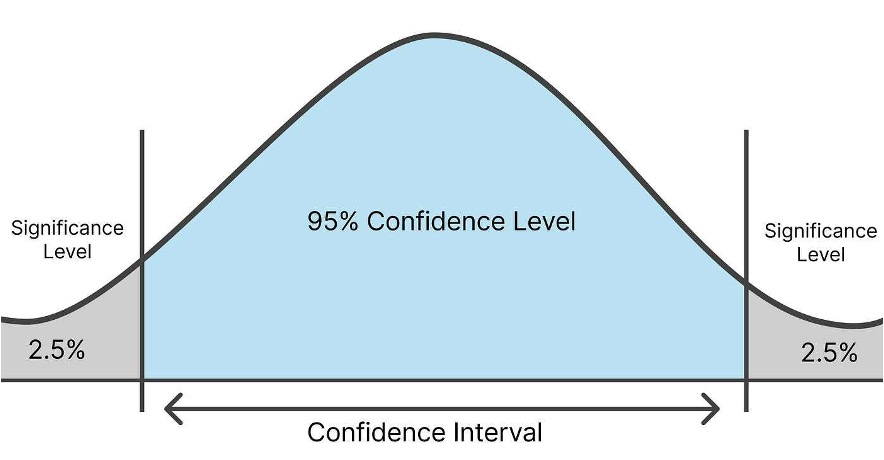
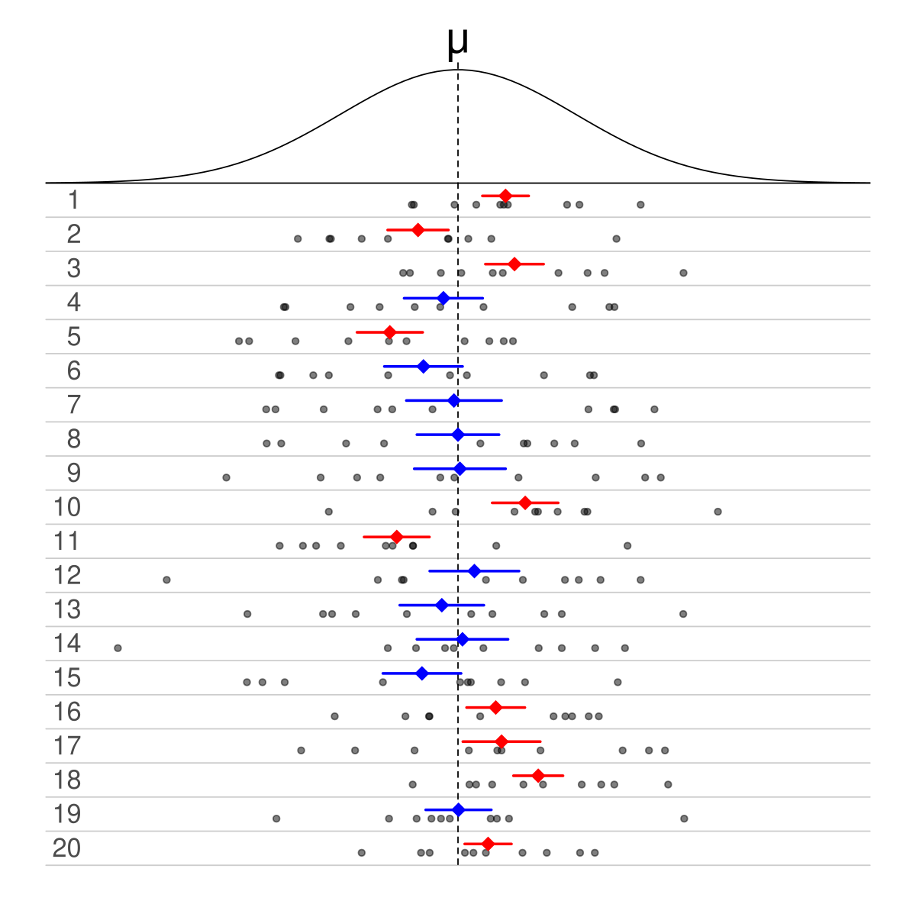

# Statistical Inference

Drawing conclusions about a **population** based on information obtained from a **sample**.

## The What

***Estimand***

* Quantity to be estimated in statistical analysis.

Types

1.  An ***unobserved*** quantity directly related to the process of interest. [i.e., prediction]

2.  **Parameters** that govern the underlying process but are not direrctly observable (i.e., mean and sd)

##

 

::: {.r-fit-text}
$$Y = \beta X + \epsilon$$
:::

## Breaking It Down {auto-animate=true}

::: {.fragment .fade-in-then-semi-out}
$${\color{#4FC3F7}{Y}} = \beta X + \epsilon$$

::: {.callout-note icon=false}
### 👁️ $Y$ — The Outcome
$Y$ is what we **observe directly** in the world.  
It's real, measurable, and varies across individuals or cases.  
Think of it as the **data we actually collect**.
:::
:::

## Breaking It Down {auto-animate=true}

::: {.fragment .fade-in-then-semi-out}
$$Y = {\color{#FF8A65}{\beta}} X + \epsilon$$

::: {.callout-note icon=false}
### 🔒 $\beta$ — The Parameters (Unobserved, Indirect)
$\beta$ is **never directly seen** — we can only *estimate* it from data.  
It represents the **true relationship** between $X$ and $Y$ in the population.  
We infer $\beta$ indirectly through the data we collect.
:::
:::

## Breaking It Down {auto-animate=true}

::: {.fragment .fade-in-then-semi-out}
$$Y = \beta X + {\color{#CE93D8}{\epsilon}}$$

::: {.callout-note icon=false}
### 🌫️ $\epsilon$ — The Error (Unobserved Uncertainty)
$\epsilon$ captures everything we **didn't measure or can't explain**.  
It is unobserved — we never know it directly.  
It represents the **irreducible randomness** in the world.
:::
:::

# {.center}

{fig-align="center"}

## Science before Statistics

* For ***statistical models*** to produce scientific insight, they require additional **scientific models**

::::{.columns}

:::{.column width = "60%"}

:::
:::{.column width = "40%"}

* Statistical Model
$$
y = kx^a
$$

* Scientific Model

$$
limb = k[body]^a
$$

:::

::::

# No cause in, No cause out

The reasons for statistical analysis are **not** found in the data themselves, but rather in the ***causes*** of the data.

* Data are meaningless in a vacuum.

## Causal Inference

::::{.columns}

:::{.column width = "60%"}

* There is more than **association** between variable.

* Causal inference is the **prediction** of *intervention*. 

* Causal inference is the **imputation** of *missing* variables.

:::

:::{.column width = "40%"}

:::

::::

## Causal **Prediction**

* Knowing a ***cause*** means being able to predict the ***consequences*** of an [**intervention**]{.underline}.

* ***What if I do this?***

{fig-align="center"}

## Causal Imputation

* Knowing a **cause** means being able to construct unobserved **counterfactual** outcomes. 

* *What if I had done something else?*

{fig-align="center"}

##

{fig-align="center"}

# Causes are [not]{.underline} optional

* Even if **descriptive**, a causal model is necessary.

* The **sample** differs from the **population**
  * If we are going to describe the population we need causal thinking.
  
{fig-align="center"}

## Directed Acyclic Graphs (DAGS)

* Heuristic model
* Clarify scientific thinking
* Can be used to deduce appropriate statistical models
* Arguably, step 1 to science and statistics

{fig-align="center"}

# What are models?

{fig-align="center"}

##

{fig-align="center"}

## Statistical Golems

{fig-align="center"}

## Issues

* Null models are rarely unique.

* It is [rare]{.underline} that any of us work in a setting where we can control all variables. 
  * We study observational systems!
  
* We know the process - but what is the null?
  * For example - $y = kx^a$. Is $x$ or $y$ ever 0 or null?
  
## Hypotheses and Models

* Research requires **more** than null robots. 

* It also requires ***generative causal models***
  *  Statistical model justified by generative models and questions with appropriate estimand. 
  
{fig-align="center"}

## Finite Data, Infinite Problems

* A DAG is not enough.
  * Spend some time in thought about your generative model?
  * How do we deduce information?
  
* We need a strategy to derive estimates and uncertainty!

[**Statistics!**]{.underline}

* **Frequentist Approaches**
* [***Likelihood-Based Approaches***]
* **Bayesian Approaches**

#

{fig-align="center"}

# Your Statistics Owl

1.  Understand what you are doing.
2.  Document your work and reduce your error.
3.  Create and follow respectable scientific workflow.

{fig-align="center"}

# The Central Problem

$$
𝑦_1, \dots , 𝑦_𝑛  \sim 𝑃
$$

## What is **P**?

* 'Holy Grail' 

* A map or function describing your system of interest.

* **Probability:**  the likelihood of some event occurring.
* **Frequency:** count of how often an event may occur

**Probability** is how many times you [THINK]{.underline} something will happen, while **frequency** is how many times it [DID]{.underline} happen

##

{fig-align="center"}

##

$$
𝑦_1, \dots , 𝑦_𝑛  \sim 𝑃
$$

* Finding *real* $P$ is **difficult**.

* Instead we search for a [component]{.underline} of the system. 
  * **Parameters**
  
* Some functional $\psi(y)$
  * $\psi$ can be anything related to your question / system at hand. 
  
# Back to Scary Math

$$
f(x) = \frac{1}{\sigma\sqrt{2\pi}} e^{-\frac{1}{2}\left(\frac{x-\mu}{\sigma}\right)^2}
$$

## $\psi(y)$

::::{.columns}

:::{.column width = "50%"}

* Mean height = $\mu$
* Variation in height = $\sigma$
* The mean can be further decomposed into parts:
  * Male vs. female
  * Age
  * Ethnicity
* $\mu$ is a **function** of elements
  * $\mu = X\beta + \epsilon$

:::

:::{.column width = "50%"}

{fig-align="center"}

:::

::::

## Putting it all together

\

$y \sim normal(\mu, \sigma)$

\

$\mu = X\beta + \epsilon$

\

$\sigma = \sqrt{\frac{\sum_{i=1}^{N} (x_i - \mu)^2}{N}}$

## What's our goal?

* Prediction
  * Find some function of $x$ than predicts the outcome $y$.
  * Less concerned with individual parameter values.

* Inference
  * Describe properties that govern the system.
  * More concerned with individual parameter values.

## Methodological Differences {.smaller}

::::{.columns}

:::{.column width = "40%"}

:::

:::{.column width = "60%"}

**Frequentist**

* Option 1: Your answer is based on the frequency of events

\

\

**Bayesian**

* Option 2: Your answer is based upon your degree of belief in your data AND the system at hand.

:::

::::

## Methodological Differences

## Tradeoff

\

**Complexity vs. Accuracy vs. Interpretability**

\

::::{.columns}

:::{.column width = "50%"}

:::

:::{.column width = "50%"}

:::

::::

## Supervision vs. Unsupervision

::::{.columns}

:::{.column width = "50%"}

:::

:::{.column width = "50%"}

:::

::::

## Classification vs. Regression

# Frequentist Inference

##

> Suppose that during a recent doctor’s visit, you tested positive for a very rare disease. If you only get to ask the doctor one question, which would it be?

* What’s the chance that I actually have the disease?
* If in fact I don’t have the disease, what’s the chance that I would’ve gotten this positive test result?

##

\
\
> ***If in fact I don’t have the disease, what’s the chance that I would’ve gotten this positive test result?***

## Frequentist Probability

The probability of an outcome is defined to be the proportion of times the outcome is observed under a ***high number of repetitions of the random process***.

\

**Long Run Frequencies**

## Hypothesis Testing

* A formal procedure for comparing **observed** data based on some claim (**hypothesis**)

* Frequentist: If in fact the hypothesis is incorrect, what’s the chance I’d have observed this, or even more extreme, data?

## Significance Testing

[**ALWAYS**]{.underline} starts at the presupposition that the null hypothesis is **true**.

* The goal is to find evidence for or against.

\

**“If nothing interesting was happening, how surprising would this outcome be?”**

\

**How ridiculous would it be to believe the null hypothesis is the true answer, given the results we see?**

## An Example:

::::{.columns}

:::{.column width = "50%"}

* Hasbro was nominated as the most handsome pup at the local humane society with 60% supporting his nomination. 

* A second round of voting occurred the next month and his support increased to 70%. 

* Is the change in Hasbro’s support ‘real’ or just noise?

:::

:::{.column width = "50%"}

:::
::::

## Step 1: Hypothesis Formation

A. Null Hypothesis

* $H_0$: Approval rating $=$ 60%

\

B. Alternative Hypothesis

* $H_A$: Approval rating $\neq$ 60%

**Key Points!**
\
1.  **Uncertainty is in the data!**

2.  Is it plausible to observe the new result (70%)?

## Remember

* The [null hypothesis]{.underline} is always about **nothing!**
  * No effect, no difference, no change, etc. 
  
* Never accept!
  * **Reject** or **Fail to Reject**
  
**Logic:**

* It is much easier to prove something is false than to prove something is true.
  * Hypothesis testing is attempting to formalize this logic. 

## Central Limit Theorem

* Remember we **sample** to approximate a **population**

* The Goal:
  * The sample statistics (i.e., mean) approximates **truth**.
  
* The **Central Limit Theorem** states that if we sample **more-and-more data**, the sampling distribution will approach normality with a mean equal to the population parameter.

## Decision

::::{.columns}

:::{.column width = "50%"}

* If we assume data is collected an [infinite]{.underline} number of times:
  * Our new approval rating is 70%. 
  * Falls outside the 95% most frequent values.

* **We reject the null and assume the bump to 70% is [real]{.underline}.**

:::

:::{.column width = "50%"}

:::

::::

## P-Values

The probability of obtaining a result as **extreme or more extreme** than what was observed. 

* **YOU!** set this level.
  * Significance level $\alpha$.
  * Traditionally: 0.05 (5%)

* This represents the amount of acceptable error, or the probability of rejecting a null hypothesis that is in fact true (the probability of Type I error (aka False Positive))

##

##

* The p-value **is not** the probability of the null being true.
  * How likely are the observed data under the null?
  
* If p is small, it means the data is unusual if the null were true. That suggests the null may not hold.

* If p is large, it means the data is consistent with the null, so we don’t have evidence to reject it.

## Simplification

* Imagine you're in court. The null hypothesis is "the defendant is innocent." The evidence (your data) is a bloody glove at the crime scene.

\

* If bloody gloves are very common even for innocent people (high p-value), then the evidence isn’t strong enough to reject innocence.

* If bloody gloves are very rare for innocent people (low p-value), then we doubt innocence and may convict.

##

* Significance (or lack thereof) does not equate to an effect or influence. (≠ Causality)

* Just because we fail to reject the null, it does not make the null ‘correct’.

* Remember, p-value are all about compatibility of your data to some pre-defined hypothesis.
  * Imagine if you collect more data....

## Hypothesis Testing {.smaller}

::::{.columns}

:::{.column width = "50%"}

* **True Positive:** $1 - \alpha$. You have the disease AND you test positive. 

* **False Negative:** $\beta$. You have the disease, but the test is negative.
  * ***Type 2 error:*** Incorrectly failing to reject the null.
  
* **True Negative:** $1-\beta$. You do not have the disease AND the test is negative. 

* **False Positive:** $\alpha$. You do not have the disease but the test is positive. 
  * **Type 1 Error:** Incorrectly rejecting the null.

:::

:::{.column width = "50%"}

:::

::::

##

## Statistical Power

$$
1 - \beta
$$

* The probability of rejecting the Null when the null is not true. 

* The probability of saying some effect exists. 

**Is this not what we want to ensure????**

## Things to Think About

* What size sample do we need to demonstrate an effect?

* What magnitude of effect is most important?

* Balance the **Type 1 Error**

##

## What about error?

PSA: Frequentist analyses DO NOT account for uncertainty in the process. They simply assume there is error in the data itself. 

## Confidence Intervals

**Remember, long run frequencies.**

* A confidence interval is constructed so that, if we were to repeat our sampling procedure many times, a certain proportion (e.g., 95%) of those intervals would contain the true parameter.

* If we repeatedly sampled data and computed a CI each time, 95% of those CIs would contain the true population parameter.

##

##

##

* A common mistake is to think a CI is *"the probability that the true mean is in this interval is 95%"* 
  * This is incorrect!
  
* Instead, the correct interpretation is: *If we repeated this process many times, 95% of our confidence intervals would contain the true mean.*

**A single confidence interval either contains the true parameter or it doesn’t—we just don’t know which.**

## Steps of a Hypothesis Test

1.  Set Hypotheses
2.  Identify the sampling distribution of the Null (𝐻_0)
3.  Calculate the p-value
4.  Make a decision and conclusion
    * Can include the CI to help with decision. 
