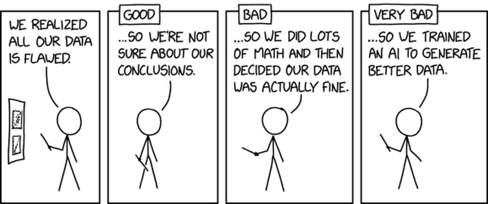
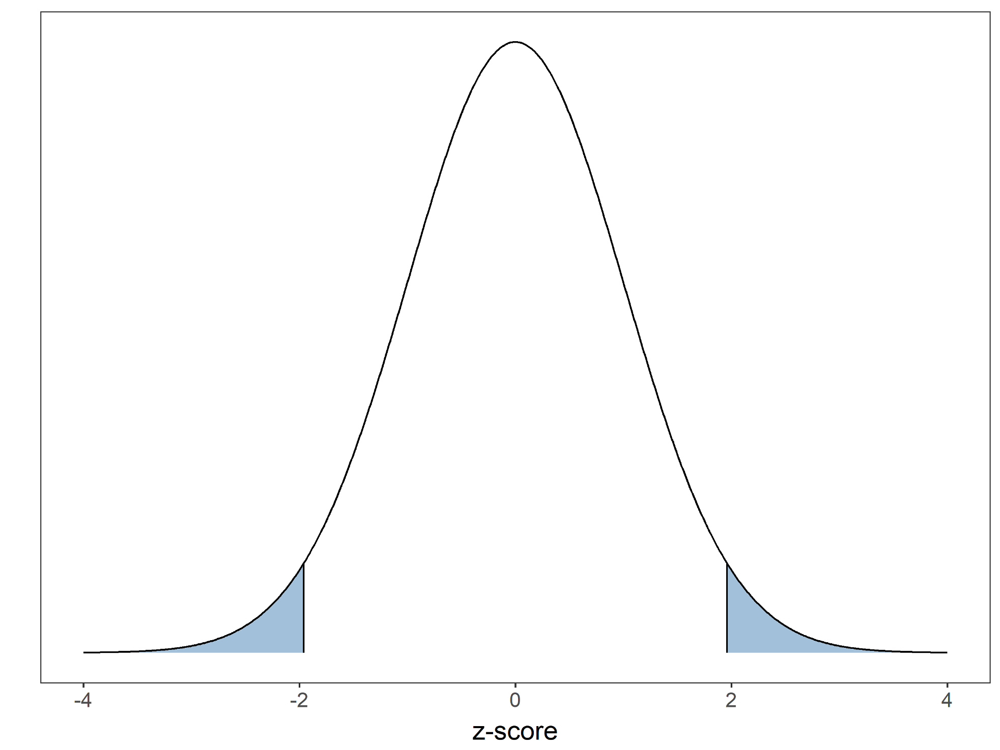
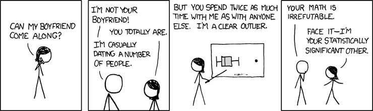
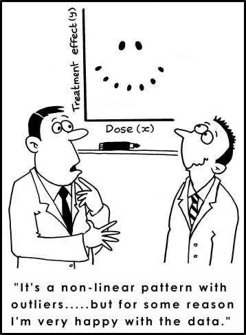
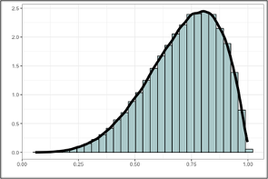
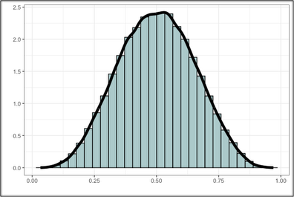
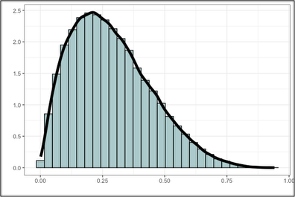
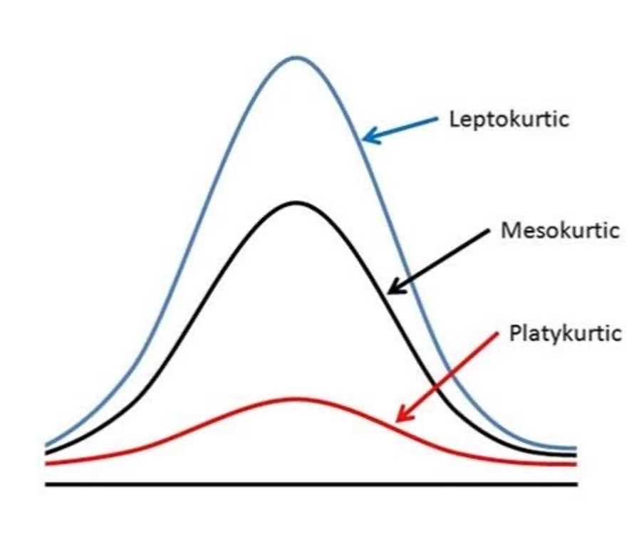
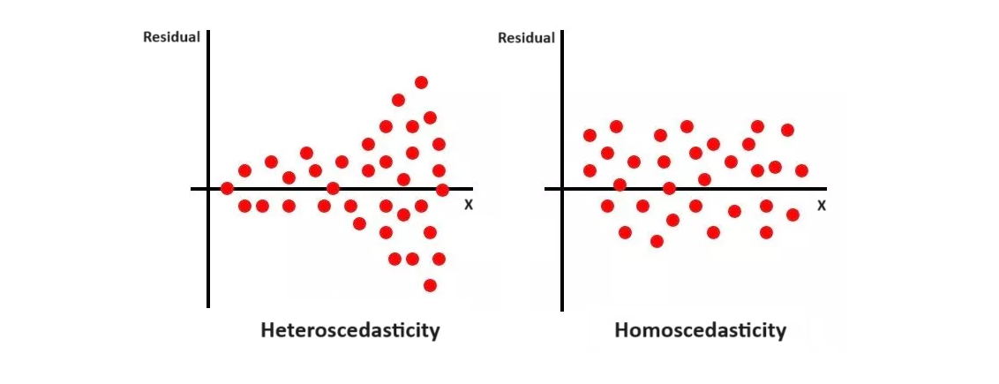

# Outliers

> “You can’t fix in analysis what you [eff] up by design.” 



## Setup

```{r}
#| echo: true
#| message: false

library(tidyverse)
library(magrittr)
library(car)
library(mvoutlier)

allcran <- read.csv("data/allcran_F.csv")
head(allcran)
names(allcran)[1] <- "id"
unique(allcran$pop)
allcran$pop <- as.factor(allcran$pop)
```

## Ways to Detect Outliers {.smaller}

* **Univariate**
  * Data falling at the extremes of a distribution
    * Boxplots, histograms / densities, descriptive statistics (skewness, kurtosis, SDs, z-scores)
* **Bivariate**
  * Paired variable outliers
    * Scatterplots, scatterplot matrices, influence plots, Cook's distance [influence plots], Hat statistic [leverage]
* **Multivariate**
  * 3+ variable cobinations that stand out
    * Mardia's Test, PCA
    
## Univariate: Z-Scores

**Z-Scores:** Data that are standardized around a mean and standard deviation

  * Centered at 0.
  * In Biological Anthropology: Anything +- 2 Standard Deviations

{fig-align="center"}

##

`scale(x, center = TRUE, scale = TRUE)`

* `x` is the variable / vector to be scaled.
* `center = TRUE` subtracts every value by the mean.
*  `scale = TRUE` divides every value by the standard deviation.
* `?scale()`

##

```{r}
#| echo: true

allcran$gol_z <- as.vector(scale(allcran$GOL, center = T, scale = T))
head(allcran, 3)
```

```{r}
#| echo: true

allcran %>% filter(gol_z > 2.0 | gol_z < -2.0)
```

```{r}
#| echo: true

# allcran %<>% filter(!(id %in% c(359, 370)))
```


## Univariate: Boxplots

Boxplots use the range of the data to find outliers.

* `<`25% quantile - IQR x 1.5
* `>`25% quantile + IQR x 1.5

```{r}
#| echo: true

allcran %>% ggplot(aes(x = pop, y = GOL)) + theme_bw() + geom_boxplot(outlier.colour = "red", outlier.size = 3)
```

##

```{r}
#| echo: true

allcran %>% arrange(GOL) %>% head(2)
```

```{r}
#| echo: true

allcran[allcran$GOL < 100, ]
```

```{r}
#| echo: true

which(allcran$GOL < 100)
```

```{r}
#| echo: true

allcran <- allcran[-c(275, 286)]
```

## Bivariate: Scatterplots

```{r}
#| echo: true

ggplot(allcran, aes(x = GOL, y = XCB)) + theme_bw() + geom_point()
```

```{r}
#| echo: true

allcran %>% filter(GOL < 100 | XCB < 100)
```

## Bivariate: Scatterplot Matrix

```{r}
#| echo: true

pairs(allcran[6:9])
```

## Univariate and Multivariate: `uni.plot(x)`

`uni.plot(x)` plots each column of x and differentiates the multivariate outliers
  * Requires complete / no missing data.
  
```{r}
#| echo: true

up1 <- mvoutlier::uni.plot(allcran[4:13])
```

##

```{r}
#| echo: true

up1
```

##

If `symb = TRUE` returns Euclidean distance between points. 

**Mahalanobis Distance:** Multivariate Distance

* + = large values
* - = small values

**Euclidean Distance:** Straight Line Distance

* <span style="color:red;">red</span> = large value
* <span style="color:blue;">blue</span> = small value

##

```{r}
#| echo: true

up2 <- mvoutlier::uni.plot(allcran[4:13], symb = T)
```


##

```{r}
#| echo: true

names(up2)
```

```{r}
#| echo: true

up2$outliers
```

##

```{r}
#| echo: true

allcran2 <- allcran[!up2$outliers,]
nrow(allcran)
nrow(allcran2)
```

## Detecting Outliers: Multivariate

**Principal Components Analysis (PCA)**

Goal: Find the direction of maximum variation in the data and replace correlated variables with a smaller number of uncorrelated variables.

* Dimensionality Reduction
* Keep as much information as possible

***Plotting the first two principal components can help identify observations that are not typical given the data.***

##

```{r}
#| echo: true

pca_out <- princomp(allcran[4:13])
biplot(pca_out)
```

##

```{r}
#| echo: true

allcran[c(275, 286), ]
```

```{r}
#| echo: true

allcran[c(305, 278, 277), ]
```

##

```{r}
#| echo: true

outliers <- allcran[c(275, 277, 278, 286, 305), ]

ggplot(allcran, aes(x = GOL, y = XCB)) + theme_bw() + geom_point(color = "grey", size = 2) + geom_label(data = outliers, aes(x = GOL, y = XCB, label = id), color = "red", size = 3)
```

## Some Code to Know{.smaller}

`slice(x)`: Removes row(s) from the dataframe by index 

```{r}
#| echo: true

dim(allcran)
```

```{r}
#| echo: true

allcran3 <- allcran %>% slice(-c(275, 286))
dim(allcran3)
```

`arrange(x)`: Arranges in ascending or descending order. 

```{r}
#| echo: true

allcran %>% select(id, GOL) %>% arrange(GOL) %>% head(3)
```

```{r}
#| echo: true

allcran %>% select(id, GOL) %>% arrange(desc(GOL)) %>% head(3)
```

## Questions to Ask Yourself

1.  Are the outliers real?
2.  Can they be fixed in some way?
3.  Was it a typo? Transcription error?
4.  Can you re-measure (or transform) the data?



## Corrective Measures

::::{.columns}

:::{.column width = "50%"}

* Transform variables.
* Remove observations. 
* Add / remove variables.
* Choose a different approach.

... or keep them!

:::

:::{.column width = "50%"}



:::

::::

# Assumptions Testing

1.  Normality
2.  Homogeneity of Variance
3.  Linearity
4.  Independence

## Normality

* Fundamental assumption in univariate and multivariate statistics.
* **Shape of the Distribution**

```{r}
#| echo: true

plot(density(rnorm(10000)))
```

## Normality: Skewness

Symmetry of the Distribution

::::{.columns}

:::{.column width = "33%"}

{fig-align="center"}

:::

:::{.column width = "33%"}

{fig-align="center"}

:::

:::{.column width = "33%"}

{fig-align="center"}

:::

::::

* `-0.5 to 0.5 == normal`
* `<-1 == left-skewed`
* `>1 == right-skewed`

## Normality

```{r}
#| echo: true

allcran <- allcran[!up2$outliers,]
psych::describeBy(allcran[4:13], allcran$pop)
```

## Normality: Kurtosis

***Vertical Peak / Height of Distribution***

* `3 == Mesokurtic`
* `<3 == Platykurtic (flat)`
* `>3 == Leptokurtic (tall)`

{fig-align="center"}

##

```{r}
#| echo: true

allcran <- allcran[!up2$outliers,]
psych::describeBy(allcran[4:13], allcran$pop)
```

## Normality

* Hugely impacted by sample size.
  *  <30 unreliable test(s)
  
The **Central Limit Theorem** says data *should* approach normal assuming infinite collection.

## Testing for Normality - Visualize

::::{.columns}

:::{.column width = "50%"}

```{r}
#| echo: true

qqnorm(allcran$GOL, frame = F)
qqline(allcran$GOL, col = "steelblue", lwd = 3)
```

:::

:::{.column width = "50%"}

```{r}
#| echo: true

ggplot(allcran, aes(x = GOL)) + theme_bw() + geom_histogram(aes(y = after_stat(density)), color = "black", fill = "white") + geom_density(fill = "steelblue", alpha = 0.4)
```

:::

::::

## Testing for Normality - Test

**Null Hypothesis: Data are normally distributed.**

Shapiro Wilks Test or Kolmogorov-Smirnov Test

* Shapiro ***should not*** be used in small samples.

```{r}
#| echo: true

shapiro.test(allcran$GOL)
```

```{r}
#| echo: true

ks.test(scale(allcran$GOL), "pnorm")
```

## Homogeneity of Variance

**Variance:** spread or dispersion around the mean

**Homoscedasticity:** the assumption that variables exhibit **equal amounts** of variance across predictors.

* Opposite is **heteroscedasticity**

{fig-align="center"}

## Testing for Homoscedasticity

**Null Hypothesis: Variances are equal across groups within sample**

**Bartlett's Test**

* Data must be normal. 

```{r}
#| echo: true

bartlett.test(formula = GOL ~ pop, data = allcran)
```

## Testing for Homoscedasticity

**Null Hypothesis: Variances are equal across groups within sample**

**Levene's Test**

* Data are non-normal.
* Small sample sizes.

```{r}
#| echo: true

car::leveneTest(GOL ~ pop, data = allcran)
```

## Testing for Homoscedasticity

**Null Hypothesis: Variances are equal across groups within sample**

**Fligner-Killeen Test**

* Data are non-normal.
* Most robust.

```{r}
#| echo: true

fligner.test(formula = GOL ~ pop, data = allcran)
```

## Linearity

**Response variable is linearly related to the predictor variable(s)**

* Implicit for all multivariate techniques based on correlational measures of association:
  * Multiple regression, logistic regression, factor analysis, structural equation modeling (SEM), etc. 

* Nonlinear effects are not represented in correlations, therefore underestimating the actual strength of the relationship

## Testing for Linearity

```{r}
#| echo: true

ggplot(allcran, aes(x = GOL, y = BBH)) + theme_bw() + geom_point(shape = 1, size = 2) + geom_smooth(method = "loess", color = "red", se = F)
```

## Independence

Each observation in the data are **independent** of each other

* $Y$ observed at one value of $X$ is in no way dependent on the values of $Y$ observed at another value of $X$

Know your data!!!

## Data Transformations?

Most assumptions can be met by transforming the data:

* Standardizing / z-scores
* Log transformations

***But what does a logged value mean?***

## Summary of Assumptions

* Outliers are typically the last step in data manipulation

* Extreme values or atypical observations can affect analyses

* Assumptions should be checked prior to choosing (and applying) any analyses to the data


